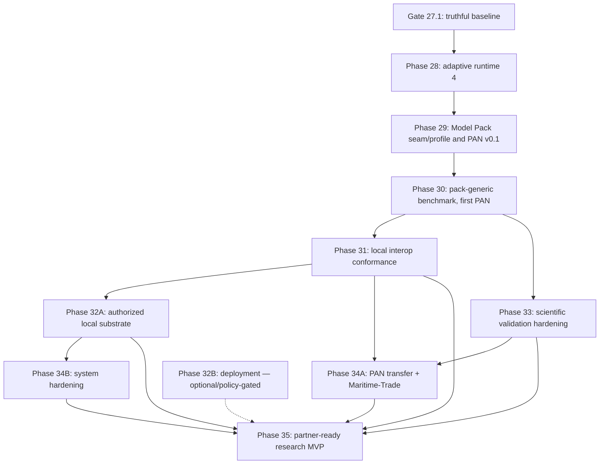

# KALHAS Strategic Handoff — Current State and Phases 28–35

Status: planning, continuity, and execution-overlay document

Evidence date: 2026-09-01 (original overlay); 2026-09-02 (H28-S13 final
closure-candidate overlay — see the second overlay section below)

KALHAS published baseline: `777a4472ef0d1edc6d30ce61a05851302b981027`

LEGION baseline retained from the prior audit (not re-audited by the 2026-09-01
overlay): `1db60222c05e8d293ec587259287ae46fab9b8d0`

This document is the recommended source of truth for the next KALHAS work.
It consolidates the available Codex project history, the local KALHAS
repository, the public KALHAS and LEGION repositories, the supplied handoffs,
the Phase 23–32 blueprint, and the supplied cognitive-architecture PDF.

It is a roadmap, not authorization to implement, stage, commit, push, deploy,
connect a provider, or perform a live action. Every implementation slice still
requires explicit user direction and must obey `AGENTS.md`.

## Gate 27.1 historical execution record — recorded before publication

Recorded 2026-08-25 by Hermes session `H27.1-S05` (final handoff/documentation
slice). This record is the authoritative execution-status overlay for Section
9 and the Section 22.15 Gate 27.1 map wherever older prose reads as pre-execution.
The bullets below intentionally preserve the pre-publication state observed on
that date. Gate 27.1 was subsequently published as commit
`777a4472ef0d1edc6d30ce61a05851302b981027`; the current Phase 28 state is
recorded in the 2026-09-01 overlay immediately after this historical record.

- Published `main` remains `a905d2af6b155a0f2568037e2b0f410b20be8d91`;
  `HEAD == origin/main`, divergence `0 0`. Every Gate 27.1 change listed here
  is local, unstaged, uncommitted, and unpublished.
- The live worktree holds exactly eleven dirty paths: modified `AGENTS.md`,
  `README.md`, `docs/architecture/README.md`,
  `docs/architecture/contracts-and-lifecycle.md`, `tests/test_boundaries.py`,
  `tests/test_phase27_boundaries.py`; untracked
  `CODEX_HERMES_HANDOFF_CURRENT_STATE.md`,
  `KALHAS_STRATEGIC_HANDOFF_PHASES_28_35.md`, `tests/phase27_1_helpers.py`,
  `tests/test_phase27_1_exact_five_acceptance.py`,
  `tests/test_phase27_1_boundaries.py`.
- `H27.1-S01` — `SESSION_AUDITED`: active post-publication documentation truth
  and its Phase 27 boundary assertions.
- `H27.1-S02` — `SESSION_AUDITED`: architecture-policy clarification;
  approval-gated skip removed (`tests/test_boundaries.py`: 17 passed, 0
  skipped; combined boundary gate at audit time: 72 passed, 0 skipped).
- `H27.1-S03` — `SESSION_AUDITED`: real unpatched exact-five campaign proof
  (focused: 35 passed; Phase 26 + Phase 27 + S03: 105 passed; no
  production/cardinality mutation, no manufactured evidence).
- `H27.1-S04-C01-DERIVED-INJECTION-DETECTOR` (fresh-session correction of the
  original `H27.1-S04-CLOSURE-BOUNDARY`) — `SESSION_AUDITED`: final focused
  boundary gate 33 passed; combined boundaries 105 passed; S03 acceptance +
  S04 boundaries 68 passed; Ruff, format-check, and mypy green; the corrected
  reusable detector catches constructed derived-evidence
  persistence/injection and accepts legal read/service paths.
- `H27.1-S05` — delivered by the 2026-08-25 edit above: the final
  handoff/documentation slice (this file's status record and the rewritten
  current-state handoff); independently audited by Codex — `SESSION_AUDITED`.
- Post-full-gate documentation truth (recorded 2026-08-25 by
  `H27.1-S05-C01-POST-FULL-GATE-TRUTH`): after its independent audit of
  `H27.1-S05`, Codex ran the single authoritative full repository gate on the
  grouped final `S01`–`S05` fingerprint on 2026-08-25 — completely green.
  Observed evidence: Pytest exit 0 with exactly 5,480 passed, 0 failed,
  0 skipped, and 4 warnings (one pre-existing Starlette deprecation warning
  plus expected Pydantic serialization warnings exercised by adversarial
  tests) in 901.64 seconds; Ruff check passed; Ruff format check passed for
  295 files; mypy found no issues in 278 source files; schema artifacts are
  synchronized; Git diff hygiene passed; nothing was staged; no Git
  publication occurred. No count was rounded or changed.
- Consequently, the Section 6.1–6.4 findings (stale active documentation, the
  skipped architecture test, the patched-cardinality acceptance proof, and the
  label-only LEGION mock differentiation) are closed locally and
  unpublished by S01–S03; Sections 6.5–6.7 remain open for later phases.
- The implementation and full repository gates are green. Neither this
  document nor any session report assigns checkpoint authority: this
  mechanical post-gate documentation correction does not independently mark
  `CP27.1` accepted, and the latest Codex live-folder audit is authoritative
  for the final `CP27.1` disposition. After Codex verifies these corrected
  handoffs on the final documentation fingerprint, it may record `CP27.1`
  as `CHECKPOINT_ACCEPTED` without another handoff edit. Until that
  disposition is recorded, the local tree remains a fully gated closure
  candidate, not an accepted checkpoint.
- Phase 28 has **not started**; no Phase 28 code exists.
- Git staging, commit, and push have not occurred and remain subject to
  separate explicit user authorization.

## Phase 28 execution and external-model review overlay — LOCAL AND UNPUBLISHED

Recorded 2026-09-01 by Codex after inspecting the live repository, profiling
the current fixtures, and reviewing the official Covasim, Starsim, and
GLEAM/GLEAMviz sources. This overlay supersedes only stale present-tense status
claims; it does not rewrite the historical Gate 27.1 evidence above and does
not authorize implementation, Git operations, provider access, or live action.

- Published `HEAD == origin/main == 777a4472ef0d1edc6d30ce61a05851302b981027`
  (`Gate 27.1: truthful baseline closure`).
- The live worktree contains the unpublished Phase 28 implementation through a
  **partial `H28-S09`** adaptive-versus-static comparison slice. `H28-S10`
  through `H28-S13` are not yet present as completed slices. The tree remains
  active and dirty; this overlay deliberately does not freeze a path inventory
  or claim checkpoint acceptance.
- An early diagnostic Phase-28-focused execution selected exactly 1,276 of
  6,760 collected tests and passed all 1,276 in 54.8 seconds. An early full-
  suite attempt then exceeded a 303-second tool limit; that timeout was neither
  a failure nor checkpoint evidence.
- After the Model Pack roadmap update and before the mechanical recording of
  this result, Codex ran the complete current repository suite normally on the
  dirty Phase 28 tree: exactly **6,760 passed**, 0 failed, 0 skipped, and 14
  warnings in 817.71 seconds. Ruff check passed; Ruff format check passed for
  353 files; mypy found no issues in 335 source files; `git diff --check` passed.
  This supersedes the earlier two-error/timeout diagnostic status.
- The green repository gate does **not** accept Phase 28: S10–S13 remain open,
  S09's reduced-cardinality fixture is not the required production-path proof,
  no grouped final Phase 28 fingerprint/checkpoint disposition exists, and no
  Git publication was authorized.
- The published Gate 27.1 unpatched exact-five proof remains real: a focused
  rerun passed all 35 tests without production/cardinality mutation.
- The current S09 comparison fixture intentionally patches campaign preparation
  to two static candidates for a bounded development proof. That fixture is
  useful but cannot serve as the final production-path Phase 28 acceptance.
  `H28-S12` must close this distinction with the unmodified exact-five
  production invariant plus an adaptive arm under shared coordinates.
- Current profiling does not reproduce the earlier reported 46-of-56-second
  fixture cost. The exact-five campaign took 1.65 seconds under profiling, with
  0.84 seconds cumulative in the defensive-copy path; the current adaptive
  comparison fixture took 0.67 seconds, with 0.33 seconds in that path. The
  defensive-copy boundary is therefore a real proportional hotspot, not a
  demonstrated blocker at current scale. It must be measured and optimized
  without weakening snapshot isolation.
- Covasim, Starsim, and GLEAM/GLEAMviz are external scientific/engineering
  references only. They add no fourth component or integration surface, and no
  external simulator, server, dataset, callback, or executable dependency is
  accepted into the KALHAS kernel by this review.

## Phase 28 closure-candidate overlay — 2026-09-02 (H28-S13; LOCAL AND UNPUBLISHED)

Recorded 2026-09-02 by the final corrected Hermes continuation of the partial
`H28-S13-DOCS-PERF-CLOSURE` session. This overlay preserves the 2026-09-01
overlay above as explicitly historical evidence of the pre-S10 state and
supersedes only its stale present-tense status claims (partial `H28-S09`,
S10–S13 open). It does not rewrite any dated historical observation elsewhere
in this document, does not authorize implementation, Git operations, provider
access, or live action, and does not assign `CHECKPOINT_ACCEPTED`.

### Slice completion truth (2026-09-02)

- `H28-S01` through `H28-S12` are **complete locally and unpublished**: the
  Phase 28 adaptive runtime `4.0.0` contracts, schemas, services, replay,
  read-only API projections, registry compatibility, and the exact-five
  adaptive acceptance all exist only in the dirty local worktree on top of
  published `777a4472ef0d1edc6d30ce61a05851302b981027`.
- `H28-S13` performance characterization and documentation edits are complete
  only after this continuation's gates finish. The gates are executed after
  this overlay text was written; if any gate fails, this session reports the
  exact evidence and creates no closure resume, and this overlay must then be
  read as a candidate record, not a completed-slice record.
- `H28-S12` exact-five-plus-adaptive acceptance is green: 24 focused tests in
  `tests/test_phase28_exact_five_adaptive_acceptance.py`; the `H28-S12` full
  suite run was **6,850 tests, 0 failures, 0 errors, 0 skipped, 810.94
  seconds** (JUnit artifact `C:/Users/xampos/AppData/Local/Temp/h28s12_full.xml`,
  1,039,417 bytes, well-formed).
- Phase 28 is a **fully gated local closure candidate only after this
  continuation succeeds**. The authoritative full-suite run for the grouped
  final Phase 28 fingerprint still belongs to the independent Codex audit.
- `CP28-B` remains pending the independent Codex final fingerprint/gate audit.
  This Hermes session does not assign `CHECKPOINT_ACCEPTED`; checkpoint
  authority belongs exclusively to that audit.
- Phase 29 is **NOT STARTED and NOT AUTHORIZED**. The next action after this
  continuation is the independent Codex final Phase 28 audit, then STOP
  awaiting explicit Phase 29 instructions.
- No commit, push, deploy, provider, or live action occurred in any H28
  session, including this continuation. Nothing is staged; `HEAD ==
  origin/main`; divergence `0 0`.
- The benchmark measurements below are hardware/runtime/fixture-shape-specific
  observations. They are not correctness claims, not scientific-validity
  claims, not regression thresholds, not benchmark gates, and not
  production-readiness claims.

### Recorded benchmark facts (raw artifact pin)

Raw artifact:
`C:/Users/xampos/AppData/Local/Temp/h28s13/h28s13_measurements.json`,
SHA-256 `5ba8234a347ab8f3bc01b225427c41d5c96c5369629708010765676dce575a4d`,
14,317 bytes, generated 2026-09-02T04:53:42Z by session
`H28-S13-DOCS-PERF-CLOSURE` (script: `h28s13_bench.py` in the same
directory). Environment identity is recorded inside the artifact: CPython
3.12.13, Windows 10 (build 19045), AMD64, 32 logical cores, uv 0.12.7.
Both fixtures: one full unprofiled warm-up run before measurement, three
measured repetitions, wall-time statistics over those repetitions.

- Fixture `exact_five_static_gate27_1` (source
  `tests/phase27_1_helpers.py`, `complete_exact_five_store`): 5 strategies,
  4 seeds, 20 static runs, 0 adaptive runs. Wall times (s):
  15.431 / 15.460 / 15.347 (min 15.347, median 15.431, mean 15.413,
  max 15.460). `_deep_copy_contract` (`in_memory_store.py`): 11,633 calls,
  7.724 s cumulative. Peak tracemalloc per repetition:
  1,865,826 / 1,866,002 / 1,813,344 bytes.
- Fixture `exact_five_plus_adaptive_h28_s12` (source
  `tests/test_phase28_exact_five_adaptive_acceptance.py`): 5 strategies,
  4 seeds, 20 static runs plus 4 adaptive runs with 2 decision steps each
  (final decision step 1). Wall times (s): 15.655 / 15.733 / 15.709
  (min 15.655, median 15.709, mean 15.699, max 15.733).
  `_deep_copy_contract`: 8,407 calls, 8.094 s cumulative. Peak tracemalloc
  per repetition: 1,663,744 / 1,884,211 / 1,899,541 bytes.
- Proportional-hotspot reading (unchanged from the 2026-09-01 profiling):
  the defensive-copy boundary is a real proportional hotspot at this scale,
  not a demonstrated blocker. No defensive copying, validation,
  immutability, replay, or tenant-isolation behavior was weakened or
  optimized; any later optimization requires a named measured threshold and
  byte-equivalent authority/replay behavior, per the §10 closure addendum.

### Documentation surfaces updated by H28-S13 (2026-09-02)

Six documentation surfaces carry the Phase 28 closure truth; ADR-004
(`docs/decisions/ADR-004-deterministic-adaptive-runtime-4.md`, git blob
`32518c01baa8443da73650b106cbd674b86b7ae8`, 12,997 bytes, 269 lines) is
intentionally byte-frozen and untouched — its implementation-status note is
carried by these dated overlays instead:

1. `README.md`
2. `docs/architecture/README.md`
3. `docs/architecture/contracts-and-lifecycle.md`
4. `CODEX_HERMES_HANDOFF_CURRENT_STATE.md`
5. `KALHAS_STRATEGIC_HANDOFF_PHASES_28_35.md` (this file; the 2026-09-02
   overlay you are reading plus the §25 status correction)
6. the external session resumes under the kalhas-project profile
   (`h28-s12-resume.md`, then `h28-s13-resume.md` after this continuation's
   gates pass)

Resulting local tree cardinality: exactly **106 dirty paths = 38 modified
tracked files + 68 untracked files** (the S12 baseline of 102 = 34 + 68 plus
the four newly modified tracked documentation files
`README.md`, `docs/architecture/README.md`,
`docs/architecture/contracts-and-lifecycle.md`, and
`CODEX_HERMES_HANDOFF_CURRENT_STATE.md`, which were clean at `777a447`).

## Phase 28 publication overlay — 2026-09-02 (PUBLISHED; supersedes only present-tense status claims)

Recorded by the user-authorized publication session on the same day as the
H28-S13 overlay above, which is preserved in full as the closure-candidate
record of its time. This overlay supersedes only stale present-tense status
claims ("local and unpublished", "closure candidate", "`CP28-B` pending",
"next action: independent Codex final Phase 28 audit"); no dated historical
observation is rewritten anywhere in this document.

- The independent Codex final Phase 28 fingerprint/gate audit verified the
  closure-candidate tree and recorded `CP28-B` as `CHECKPOINT_ACCEPTED` on
  **2026-09-02**. Phase 28 (adaptive deterministic runtime `4.0.0`,
  `H28-S01` through `H28-S13`) is **complete**.
- Under explicit user authorization, the publication session re-verified the
  full baseline live (branch `main`; `HEAD == origin/main ==
  777a4472ef0d1edc6d30ce61a05851302b981027`; divergence `0 0`; staged 0;
  dirty exactly 106 = 38 modified + 68 untracked, byte-exact against the
  H28-S13 resume inventory; ledger 90/90 at SHA-256 `a7937bf7...ee152`;
  schemas 55/56), re-ran the focused Phase 28 and documentation/boundary
  gates plus Ruff check, Ruff format check, strict mypy, and the
  schema-export check, and stages exactly the audited 106-path inventory
  with the minimal final status corrections as the Phase 28 closure commit.
  The repository-presentation work follows as a separate documentation
  commit; both commits are then pushed to `main` under the same explicit
  authorization. The exact commit hashes are recorded in the publication
  session report; this overlay intentionally does not duplicate them.
- After the Phase 28 commit, the same session adds an original repository
  presentation (banner, condensed README with the phase history preserved
  under `docs/`, community and CI files) as a separate documentation commit,
  also under explicit user authorization.
- **Phase 29 is NOT STARTED and NOT AUTHORIZED.** It requires new explicit
  user authorization; the read-only Phase 29 entry audit (§13) must precede
  any implementation session.

## 1. Executive verdict

KALHAS is not an early prototype anymore. Through Phase 27 it is a strong,
domain-neutral, deterministic research kernel with unusually serious
provenance, replay, uncertainty, fair-comparison, and adversarial-test
discipline.

The honest maturity assessment is:

| Area | Current maturity |
| --- | --- |
| Deterministic world and simulation kernel | Mature prototype |
| Evidence integrity and replay | Mature prototype |
| Campaign decision semantics | Implemented and heavily tested |
| Adaptive policies | Phase 28 active locally through partial H28-S09; unpublished and not closed |
| Executable real domain mechanism | Not implemented; Phase 29 |
| Government-grade Model Pack portfolio | Release/assurance architecture and phased portfolio defined here; no pack is government-certified or approved for live use |
| Historical calibration and external validity | Not demonstrated; Phase 30 |
| Real LEGION interoperability | Pre-contract; Phase 31 conformance not demonstrated |
| Auditable NEXUS implementation | Repository supplied separately; Phase 31 conformance not demonstrated |
| Durable/concurrent operation | Not implemented |
| Production deployment and live providers | Deliberately out of scope |
| Real-world predictive validity | Unproven and must not be implied |

The central conclusion is therefore two-sided:

1. The KALHAS foundation is substantially stronger than a normal MVP and is
   ready for the next scientific layer.
2. The three-system product is not integrated yet. Repository existence does
   not equal a versioned NEXUS–LEGION–KALHAS conformance proof; that remains a
   Phase 31 gate.

The correct next move is to finish and independently close Phase 28, including
the production-cardinality adaptive proof and full quality gates, then enter
the already-planned Phase 29 mechanism seam. We should not silently renumber or
discard the accepted Phase 28–35 roadmap.

**Architecture-readiness verdict:** this is complete as a gated execution
architecture for Phases 28–35: ownership, dependency order, version surfaces,
artifact authority, deterministic/replay/fairness rules, scientific and product
acceptance, blocking decisions, and bounded Hermes execution are all allocated.
It is deliberately not a frozen class-by-class implementation specification.
Rows marked ADR/external decision are explicit entry gates, not permission for
an implementer to guess. Audited three-repository conformance, real second-
platform execution, dataset/license evidence, and scientific approvals remain
external closure dependencies where the relevant phase says so.

## 2. Authority and source precedence

When sources disagree, use this order:

1. `AGENTS.md` and explicit current user instructions.
2. The observed repository, tests, schemas, Git state, and independently run
   gates.
3. The current-state handoff.
4. The accepted Phase 23–32 implementation blueprint.
5. Historical phase handoffs and project chats.
6. External strategic documents and conceptual architecture material.

Consequences of that order:

- The strict three-role architecture in `AGENTS.md` is authoritative.
- `KALHAS_HANDOFF_PHASE_27.md` is a valid historical pre-publication snapshot,
  not the current Git state.
- Earlier maritime-demo material was superseded by the durable
  domain-neutral-kernel rule. A maritime or pandemic implementation can exist
  only as a domain pack.
- `Model Pack` is product vocabulary for an exact versioned `DomainPack`
  release plus its bound evidence/assurance artifacts. It never authorizes a
  fourth component, new protocol, plugin bus, or kernel domain branch.
- Partner/funding material is strategic context, not technical authority. No
  real organization, patient, or personal data may be copied into repository
  code, fixtures, tests, or examples.
- The cognitive-architecture PDF can inform NEXUS and LEGION design, but it
  does not authorize neural or LLM behavior inside KALHAS's replay-critical
  deterministic kernel.

## 3. Verified repository state

At the current 2026-09-01 overlay date:

- Repository/origin: <https://github.com/Encomm-Tensor-Intelligence/Encomm_Kalhas>
- Branch: `main`
- Local `HEAD`: `777a4472ef0d1edc6d30ce61a05851302b981027`
- `origin/main`: `777a4472ef0d1edc6d30ce61a05851302b981027`
- Divergence: `0 0`
- Gate 27.1: published
- Phase 28: active in the local dirty/unpublished worktree through partial
  `H28-S09`; S10–S13 and final closure gates remain open
- Historical evidence-date snapshot (2026-08-19): at that time the worktree
  held only the preserved untracked `CODEX_HERMES_HANDOFF_CURRENT_STATE.md`
  plus this strategic handoff. The exact Gate 27.1 pre-publication inventory is
  preserved in the historical record at the top; both snapshots are superseded
  for present-tense execution by the Phase 28 overlay.

The public history is coherent through:

- Phase 23: objective-to-metric evaluation;
- Phase 24: deterministic world-uncertainty realizations;
- Phase 25: realization-aware runtime `3.0.0`;
- Phase 26: empirical campaign-outcome distributions;
- Phase 27: evidence-based campaign decision support;
- Gate 27.1: truthful unpatched exact-five closure.

Historical published Phase 27 scale (retained for comparison):

- 50 registered public v1 contracts;
- 50 synchronized JSON Schema artifacts;
- 43 OpenAPI paths and 54 operations;
- 135 production Python files, approximately 38,958 lines;
- 140 test files, approximately 87,068 lines.

Historical Phase 27 publication evidence: the recorded Phase 27 full-suite
result was 5,411 collected, 5,410 passed, one expected skip, zero failures,
and zero errors. Independent static checks during that audit passed Ruff,
formatting, mypy, schema synchronization, and Git diff hygiene. These values
describe the published Phase 27 tree only — they are not the Gate 27.1 result,
and the skip no longer exists after Gate 27.1 S02.

Gate 27.1 full-suite result (authoritative for the grouped final
`S01`–`S05` fingerprint): on 2026-08-25, after independently auditing the
`H27.1-S05` documentation slice, Codex ran the single authoritative full
repository gate — completely green. Exactly **5,480 passed**, 0 failed,
0 skipped, 4 warnings (one pre-existing Starlette deprecation warning plus
expected Pydantic serialization warnings exercised by adversarial tests) in
901.64 seconds; Ruff check passed; Ruff format check passed for 295 files;
mypy found no issues in 278 source files; schema artifacts are synchronized;
Git diff hygiene passed with nothing staged and no Git publication. The
historical Phase 27 counts above remain historical only.

Current Phase 28 diagnostic scale is recorded only in the overlay: 6,760 tests
passed completely, Ruff/format/mypy/diff hygiene are green, but S10–S13 and the
final production/checkpoint evidence remain open. This clean intermediate tree
is not a Phase 28 checkpoint.

## 4. What KALHAS implements today

The published evidence chain through Gate 27.1 is:

```text
Scenario
  -> declarative DomainPack inputs and catalogs
  -> immutable compiled world
  -> declared uncertainty and shared-seed realizations
  -> LEGION-shaped strategy and trajectory proposals
  -> KALHAS validation and binding
  -> deterministic runtime 1.0 / 2.0 / 3.0 execution and replay
  -> metric observations
  -> objective evaluations
  -> empirical outcome distributions
  -> paired comparison, feasibility, Pareto, and minimax-regret evidence
  -> CampaignDecisionBrief
```

KALHAS already owns the correct things:

- versioned world models and immutable content identity;
- canonical serialization, hashes, identifiers, and provenance;
- explicit uncertainty declarations and shared seed ensembles;
- deterministic planning, execution, replay, and reconstruction;
- exact tenant and ownership validation;
- identical-condition strategy comparisons;
- objective evaluation and empirical outcome distributions;
- paired win/loss/tie evidence, feasibility, Pareto dominance, and minimax
  regret;
- honest terminal states: preferred, inconclusive, insufficient evidence, and
  no feasible strategy;
- read-only derived queries that rebuild authority from verified upstream
  records rather than trusting a stored derived payload.

These are real strengths. The repository's defensive-copy, forged-hash,
tamper-position, failure-atomicity, and replay tests are unusually extensive.

The local unpublished Phase 28 tree additionally contains runtime-4 causal
observation declarations/events, closed adaptive-policy contracts and state,
adaptive execution/replay, campaign planning, and partial adaptive-versus-static
comparison evidence. These are implementation progress, not published or
checkpoint-accepted capability until S10–S13 and the final gates close.

## 5. What KALHAS does not establish

Deterministic correctness is not the same as scientific validity. The current
system does not establish:

- that a world model accurately represents reality;
- that a seed ensemble is representative;
- calibration against held-out observations;
- causal validity outside the declared mechanism;
- historical predictive performance;
- robustness to model misspecification;
- external expert validation;
- an executable or validated PAN, Maritime, Climate, Energy, Economy, Policy,
  or other Model Pack before its named future gates close;
- government certification, procurement suitability, regulatory conformity,
  or authorization for any public decision;
- safe production concurrency or durability;
- authorization to take any real-world action.

The fixed 100-seed acceptance campaigns are excellent deterministic proofs.
They are not evidence that 100 seeds are sufficient for any real decision.

The product statement to preserve is:

> KALHAS does not predict one future. It constructs bounded, reproducible
> possible worlds, tests strategies under identical declared uncertainty, and
> identifies which decisions remain robust across recorded assumption variants.

Robustness to genuinely wrong or omitted model assumptions is a Phase 30/33
evaluation target, not a capability established by the current kernel.

## 6. Historical Gate 27.1 findings closed before Phase 28 behavior

Sections 6.1–6.4 below preserve the findings that motivated Gate 27.1 and are
closed in published commit `777a447`. Sections 6.5–6.7 remain relevant later-
phase risks. Present-tense repository state comes from the 2026-09-01 overlay,
not from the pre-closure wording inside these historical findings.

### 6.1 Active documentation still contains pre-publication claims

Several active tracked sections still say Phase 26 or 27 is uncommitted or not
pushed even though `HEAD == origin/main == a905d2a`:

- `README.md` around the Phase 26 and Phase 27 status sections;
- `docs/architecture/README.md` around the Phase 27 status;
- `docs/architecture/contracts-and-lifecycle.md` around the Phase 27 status;
- `tests/test_phase27_boundaries.py`, which currently requires the obsolete
  wording.

The historical Phase 27 handoff should remain historical. Active documentation
and its boundary test should be made post-publication truthful, and the current
state handoff should become the explicit continuation record when authorized.

### 6.2 One architecture test is permanently skipped by a wording conflict

`tests/test_boundaries.py` contains a skip related to wording that permits
"governed internal KALHAS modules," while the current `AGENTS.md` states that
no components other than NEXUS, LEGION, and KALHAS exist.

The correct resolution is not to weaken `AGENTS.md` implicitly. Clarify that
ordinary internal modules remain part of KALHAS and are not new components,
then make the test deterministic and consistent with the authoritative rule.

### 6.3 Phase 27's meaningful acceptance proof patches production cardinality

Production campaign preparation currently requires exactly five LEGION
candidates. Phase 26 and Phase 27 acceptance helpers patch that constant to two
and three candidates respectively. Exact-five is an application invariant, not
a frozen constraint in `CampaignSpec` or the `LegionAdapter` protocol.

The downstream evidence is real, but the exact demonstration is not accepted
by the unmodified production preparation path. For the current v1 behavior,
the safest closure is:

- keep the five-candidate production rule temporarily;
- create five causally different executable trajectory-plan drafts, not merely
  five labels or declarations;
- prove the public path without monkeypatching a production constant;
- require materially distinct verified trajectories or outcomes;
- defer variable cardinality to an explicit interoperability behavior decision
  in Phase 31.

Relaxing the invariant may be backward compatible and does not automatically
require v2. It still requires explicit authorization, cost bounds, adversarial
tests, documentation, and a compatibility decision before implementation.

### 6.4 The default LEGION mock varies labels, not behavior

`MockLegionAdapter` returns five labeled candidates, but by default proposes
the same transition-catalog ordering for each. The standard application can
exercise the pipeline but cannot demonstrate a meaningful preferred-strategy
outcome without a test-only adapter.

The closure proof needs five bounded, deterministic, declarative, and causally
different ordered transition plans whose verified executions produce
materially different trajectories or outcomes. They remain proposals; KALHAS
must validate and bind them.

### 6.5 The NEXUS adapter is behind the Phase 27 artifact model

`NexusAdapter.present()` accepts the legacy `DecisionBrief`, while Phase 27's
terminal artifact is `CampaignDecisionBrief`. `MockNexusAdapter` also does not
implement the same `present()` surface as the declared protocol.

This is not evidence of a broken KALHAS decision engine. It is evidence that
the NEXUS presentation boundary is still a placeholder. The canonical handoff
must be designed and conformance-tested in Phase 31 without mutating frozen
contracts.

### 6.6 Operational maturity remains local and sequential

The in-memory store is approximately 1,830 lines of dictionary-backed state
with no transaction or locking boundary. Existing atomicity tests establish
sequential zero-or-one-write behavior, not concurrent safety.

There is currently no authentication, durable database, job queue,
cancellation model, resource ceiling, CI workflow, deployment configuration,
or production observability. Campaign cost grows at least with strategies ×
seeds, while pair evidence grows with strategies squared × objectives × seeds.

This is acceptable for the current local MVP, but must remain explicit.

### 6.7 Secondary maintenance risks

- Several services, routes, contracts, and the store are very large.
- The full test suite takes roughly twelve minutes.
- There is no property-testing, fuzzing, coverage, or benchmark gate.
- A Starlette/httpx TestClient deprecation warning remains.
- Application/package version descriptions still contain early-phase text.
- v1 `schema_version` validates semantic-version syntax but not equality with
  the expected contract version.
- Some early v1 Pydantic contracts are mutable while later artifacts are
  frozen; deep-copy isolation protects storage, but v1 cannot be silently
  hardened in place.
- Neither public repository currently exposes a release tag, protected branch,
  GitHub Actions workflow, or detected root license.

## 7. NEXUS–LEGION–KALHAS architecture

The three roles are complementary, not interchangeable:

| Role | Owns | Must not own |
| --- | --- | --- |
| NEXUS | Dialogue, organizational context, memory, explanation, presentation | Simulation truth, hidden evidence edits, strategy execution |
| LEGION | Strategy exploration, candidate diversity, critique, proposal generation | World authority, deterministic replay, final evidence |
| KALHAS | Versioned worlds, uncertainty, validation, simulation, replay, evidence, comparison | Natural-language organizational memory, open-ended agent exploration |

The target exchange map is:

```text
NEXUS
  | ContextBundle + ScenarioSpec + explicit authoring declarations
  v
KALHAS
  | StrategyRequest / StrategyTrajectoryPlanRequest
  v
LEGION
  | ordered StrategyCandidate tuple
  | untrusted StrategyTrajectoryPlanDraft
  v
KALHAS
  | validates, binds, hashes, records, simulates, compares, replays
  | CampaignDecisionBrief + evidence/provenance references
  v
NEXUS
  | presents without changing evidence
  v
User
```

Hard integration invariants:

- No KALHAS import of NEXUS or LEGION internals.
- No shared fourth gateway or hidden integration component.
- Every Model Pack remains a KALHAS `DomainPack` release/internal domain-pack
  implementation; it is never a fourth role or direct NEXUS/LEGION integration.
- LEGION output is always untrusted authoring input.
- KALHAS owns deterministic IDs, hashes, validation, and evidence.
- NEXUS may explain evidence but may not alter it.
- Replay and read-only queries never reinvoke NEXUS, LEGION, an LLM, or a
  provider.
- Provider nondeterminism, if ever authorized, ends before the KALHAS record
  boundary. The exact proposal accepted by KALHAS must be recorded.

## 8. Current LEGION and NEXUS reality

### 8.1 LEGION

The audited public LEGION baseline is:

- repository: <https://github.com/Encomm-Tensor-Intelligence/encomm-legion>
- commit: `1db60222c05e8d293ec587259287ae46fab9b8d0`
- local-first Python CLI, SQLite, and JSON artifacts;
- deterministic control-plane, checkpoint, and mock-runtime behavior with
  milestones marked through M25; historical provider-generated content is not
  deterministic and can only become recorded untrusted input;
- current mission facade explicitly mock-only, local, and network-free.

Its real artifacts are generic `Mission`, `BranchPacket`, `WorkerCandidate`,
`CaptainSelection`, `BranchResultPacket`, and `FinalSynthesis`. It has no
KALHAS-aware service/API and its schemas do not carry the KALHAS identifiers,
world/profile hashes, ordered shared-seed identity, policy rules, transition
catalog references, tenant identity, or provenance required by the current
adapter contracts.

No exact `KALHAS` or `NEXUS` reference was found in the audited LEGION tracked
text. Therefore LEGION is independently useful but not yet a KALHAS strategy
provider.

### 8.2 NEXUS

A public NEXUS repository has since been supplied at
<https://github.com/Encomm-Tensor-Intelligence/Encomm_nexus>, superseding the
earlier finding that no repository link was available. The 2026-09-01 external-
simulator review did not perform a fresh NEXUS release/conformance audit, and
repository existence is not evidence of the Phase 31 exchange profile or
three-role end-to-end behavior.

NEXUS must therefore still be treated as a defined architectural role plus a
not-yet-conformance-proven KALHAS boundary, not as an already verified
integration. Phase 31 closure requires the real repository to pass its owned
fixtures and the frozen local three-role acceptance.

### 8.3 Implication of the cognitive-architecture PDF

The supplied 43-page PDF is best understood as NEXUS-oriented cognitive
architecture ideation, despite its filename. Its themes include model routing,
sparse activation, distributed cognitive nodes, memory streams, internal
simulation, planner/critic structures, a global workspace, actions, and
learning. It treats consciousness-like claims as theoretical and argues that
architecture matters more than raw model size. It supplies no cited research,
benchmarks, measured sizing evidence, or validated procurement model. Its AGI,
hardware, model, and "cognitive neuron" examples are hypotheses, not technical
requirements for Phase 32 or evidence for a hardware purchase.

Useful implications:

- NEXUS can own dialogue/workflow routing, organizational context, memory, and
  user explanation, but not candidate-strategy planning.
- LEGION can own candidate-plan generation and use worker/critic/captain-style
  exploration.
- KALHAS should remain the bounded world-and-evidence service.
- Any PDF-described NEXUS "internal simulation" is illustrative cognition, not
  authoritative world simulation; the latter remains exclusively KALHAS.
- Neural or LLM systems may propose hypotheses and policies only through
  recorded adapter inputs.
- Black-box learning must not enter deterministic execution, comparison, or
  replay unless introduced later as an explicitly versioned recorded model
  with reproducible inference—a scope not authorized by this roadmap.

### 8.4 Cross-phase artifact and authority ledger

Every future artifact must have one authority. A stored copy, UI projection,
LEGION proposal, NEXUS explanation, or operational checkpoint must never become
a second source of truth.

| Artifact family | Producer | KALHAS treatment and authority | Replay/read behavior |
| --- | --- | --- | --- |
| Context/scenario authoring envelope | NEXUS or local author | Untrusted input until validated into a KALHAS `ScenarioSpec` and declarations | Replay uses the accepted recorded form, never new dialogue |
| Compiled world and world manifest | KALHAS | Canonical immutable authority with identity/content hash | Reverified before every execution/derivation |
| Uncertainty model and seed ensemble | KALHAS from accepted declarations | Canonical ordered exogenous-condition authority | Same ordered coordinates for every compared policy |
| Strategy/trajectory request | KALHAS | Hash-bound request derived from verified world/catalog/policy needs | Recorded when an external proposal is accepted |
| Raw LEGION response | LEGION | Untrusted audit input; never executable by itself | Exact immutable bytes are stored or placed in a guaranteed-available content-addressed local artifact; hash-only reference is insufficient |
| Bound strategy/trajectory declaration | KALHAS | Canonical only after closed-catalog, ownership, ordering, and safety validation | Exact accepted declaration drives replay |
| Adaptive-policy draft | LEGION or local author | Untrusted AST candidate | Never evaluated before KALHAS binding |
| Bound adaptive policy and initial policy state | KALHAS | Canonical runtime-4 authority | Immutable input to every execution/replay |
| External/offline observation input | Offline authoring/benchmark source | Untrusted until validated and recorded as a versioned runtime input | Replay uses the accepted immutable input bytes |
| State-derived observation event | KALHAS runtime | Derived ordered evidence, not an independent input authority | Replay recomputes from verified state + addressed noise, hash-compares, then evaluates the policy |
| Policy snapshot, decision, and switch events | KALHAS runtime | Canonical ordered decision evidence with source step/state/hash | Reconstructed/verified without NEXUS/LEGION/provider calls |
| Domain-pack manifest and mechanism implementation | Domain pack | Manifest/config/code identity accepted through `DomainPack`; kernel never owns domain behavior | Exact pack/mechanism/numeric version is pinned in run evidence |
| Model Pack release/assurance profile | KALHAS domain-pack release workflow | Product/catalog metadata bound to one exact `DomainPack`, mechanism, configuration, data, review, and evidence identity; never an executable surface or independent authority | Maturity and claims derive from bound evidence; no version or other pack inherits them silently |
| Dataset, transformation, split, and benchmark manifests | Offline curator/research workflow | Untrusted until checksum, license class, schema, time, unit, and split validation | Immutable bundle; no runtime download |
| Benchmark, calibration, validation, and claim-assessment reports | KALHAS evaluation workflow | Derived evidence bound to immutable inputs/protocol versions | Recomputed/verified; earlier reports never overwritten |
| Campaign comparison and decision brief | KALHAS | Authoritative derived evidence from verified upstream artifacts | Read-only reconstruction; no second persisted authority unless explicitly designed |
| NEXUS view model/explanation | NEXUS | Non-authoritative presentation bound to KALHAS source IDs/hashes | May be regenerated; cannot change evidence or decision state |
| Repository component sub-bundle | Owning KALHAS, LEGION, or NEXUS role | Immutable package/manifest for that repository's release; KALHAS evidence authority remains unchanged | Verified against its exact repository identity before consolidation |
| Consolidated release/evidence bundle | NEXUS-owned post-release exporter | Content-addressed build artifact binding all three frozen releases and subordinate hashes; never a self-referencing tracked source file | Regenerated with a new bundle identity after any component release change |
| Partner-evaluation finding | NEXUS workflow from an external reviewer | Non-authoritative append-only review artifact bound to release/source hashes | May request a new evidence branch; never overwrites KALHAS authority |
| Job, lease, checkpoint, progress, and read projection | KALHAS operational layer | Operational metadata, not scientific/decision authority | Retry/recovery cannot change canonical final artifacts |
| Colony/living-simulation activity | KALHAS read model or recorded LEGION activity | Verified only when linked to real artifacts; otherwise explicitly synthetic | UI replay must preserve the verified/synthetic distinction |

### 8.5 Independent version and compatibility matrix

Do not use one global application number as a substitute for the independent
versions below.

| Surface | Current/next rule | Additive-compatible change | Breaking-change trigger |
| --- | --- | --- | --- |
| HTTP API | Existing `/v1`; future routes additive by default | New route/operation with existing meanings preserved | Changed request/response/error meaning requires `/v2` |
| Public contract models | Shipped v1 model definitions are frozen | A new separately named contract may be registered additively after review | Field, validator, literal, default, ordering, or semantic change to shipped model requires `contracts/v2` |
| JSON Schemas | One generated artifact per public contract | New synchronized schema for new contract | In-place incompatible schema change is forbidden |
| Runtime | `1.0.0`, `2.0.0`, `3.0.0`; Phase 28 proposes `4.0.0` | New runtime dispatcher/path | Reinterpreting a recorded old runtime is forbidden |
| `DomainPack` | Current protocol is manifest-only | Explicitly versioned/additive mechanism capability after ADR | Making old manifest implementations executable/incompatible silently is forbidden |
| Domain mechanism | Absent; Phase 29 introduces independent version | New mechanism version with old implementation retained | Solver/state/action/emission/numeric semantic change requires new mechanism version |
| Model Pack profile/maturity | Product metadata over an exact `DomainPack` identity; no separate protocol | New evidence may advance the exact release's bounded status without changing execution semantics | Mechanism, assumptions, data, numerics, intended use, behavior, or claim scope change requires a new pack/evidence identity and reassessment |
| World/model declaration | Existing immutable versioned contracts | New world/model artifact referencing old inputs | Mutation of old world identity or meaning is forbidden |
| Dataset/transformation/split | Absent as public benchmark lineage | New immutable manifest/checksum/version | Replacing bytes or split membership under same identity is forbidden |
| Benchmark/calibration protocol | Absent | New protocol/report version | Changing window, score, baseline, threshold, or leakage rule under same version is forbidden |
| Interop envelope/profile | Placeholder adapters only | New profile negotiated by both repositories | Changed framing, required fields, ownership, or error semantics requires a new profile |
| Durable-store schema/migration | Absent before Phase 32A | Additive read projection plus forward-tested versioned migration | Changing authoritative bytes, tenant/uniqueness meaning, or on-disk semantics requires a new store-schema version and explicit migration; old evidence is never reinterpreted |
| Job/checkpoint protocol | Absent before Phase 32A | Additive operational metadata that preserves the closed state machine and deterministic resume | Changed state/lease/cancellation/checkpoint meaning requires a new job-protocol version; an old checkpoint is read under its recorded version or rejected, never silently reinterpreted |
| Release/evidence bundle | Absent | New post-release content-addressed build manifest referencing frozen repository/artifact identities | Replacing a component, exporter, or referenced artifact without a new bundle identity is forbidden; the final manifest is never self-referential tracked source |
| Partner-evaluation protocol | Absent before Phase 35 | New finding/disposition type that preserves source binding and non-authority | Changed provenance, supersession, evaluator-role, or authority meaning requires a new protocol version; findings never become KALHAS truth silently |

Before every new contract, Codex must record whether the change is:

1. a new additive v1 artifact;
2. an internal implementation detail with no public semantic change; or
3. a breaking change requiring new contract/API/runtime/mechanism/profile
   versions.

### 8.6 Dependency and entry-gate graph



Rules:

- Phase 32B is not required for a local Phase 35 release candidate.
- Read-only design/conformance work for later phases may run in parallel, but
  implementation cannot bypass its dependency gate.
- Scientific review and dataset licensing are external entry gates; code
  completion cannot substitute for them.
- A portfolio catalogue entry creates no capability. Each Model Pack repeats
  its own data, evidence, review, release, and presentation gates; D34-04 blocks
  the first substantive non-health implementation.
- Without an auditable NEXUS implementation, Phase 31 may close only as
  `KALHAS interop-ready`, never as complete three-system integration.

### 8.7 Blocking decision/ADR register

Every row marked `ADR required` blocks behavioral implementation for that
scope. Codex owns the read-only architecture audit by default. If the user
explicitly delegates one narrow repository-mapping task to Hermes, it still
uses one fresh session/one prompt and may not implement the ADR answer.

| ID | Decision | State before implementation |
| --- | --- | --- |
| D27.1-01 | Exact-five reference proof and post-publication truth | Frozen by Gate 27.1 scope |
| D28-01 | Policy AST, default/fallback, precedence, conflict, hysteresis/cooldown, and switch budget | ADR required |
| D28-02 | Causal within-step observation/action schedule and missing/late/noisy observation semantics | ADR required |
| D28-03 | Exogenous RNG addressing and shared-seed fairness under adaptive branching | ADR required |
| D28-04 | Runtime-4 artifact persistence versus verified derivation | ADR required |
| D29-01 | Versioned evolution of the manifest-only `DomainPack` protocol | ADR required |
| D29-02 | Pure mechanism seam, composition/registration, solver, precision, rounding, and platform semantics | ADR required |
| D29-03 | Product term `Model Pack`, common release/assurance profile, evidence-maturity states, compatibility rules, and portfolio catalogue; this creates no new component or protocol | ADR required before any pack is described beyond `conformance_only` |
| D30-01 | Dataset license class, raw-to-curated lineage, time/unit/missing/revision rules, and locked holdout | External evidence plus ADR required |
| D30-02 | Deterministic fitting/baseline rules and evidence-update branching | ADR required |
| D31-01 | NEXUS-outer/KALHAS/LEGION topology and repository ownership | Role topology frozen; ADR confirms concrete public boundary and legacy `NexusAdapter` disposition; real NEXUS remains external dependency |
| D31-02 | Local transport/framing/security/version-negotiation profile | ADR required |
| D31-03 | Five versus bounded-variable strategy cardinality | Explicit behavior/compatibility decision required |
| D32-01 | Meaning of local durable/background effects under current MVP policy | User authorization and ADR interpretation required |
| D32-02 | Store engine, transaction aggregates, job lifecycle, local identity proof/credentials/sessions/keys, RBAC, audit integrity, backup/restore, and retention | ADR required after D32-01 |
| D33-01 | Preregistered scientific thresholds and claim-assessment states | External scientific approval required |
| D34-01 | Cross-platform byte equality versus declared numerical tolerance/platform identity | ADR required no later than Phase 29 |
| D34-02 | Benchmark hardware profiles and performance-regression thresholds | ADR required |
| D34-03 | Dependency/SBOM license disposition and approved remediation | User/legal governance decision required after inventory |
| D34-04 | Bounded scope, public/synthetic data rights, intended/prohibited uses, baseline, and domain-review plan for `KALHAS-MARITIME-TRADE` v0.1 | Decision plus domain/data/license readiness evidence required before its implementation |
| D35-01 | Offline process topology, release-bundle manifest, upgrade/rollback, and verified view model | ADR required |
| D35-02 | Exact module/view-contract allocation inside the frozen KALHAS read-model and NEXUS presentation-shell roles | ADR required; no fourth component |

### 8.8 Universal validation and deterministic execution order

Unless a versioned runtime explicitly records a different order, every write
or derived operation follows this fail-closed pattern:

1. validate tenant and caller-owned shape;
2. load the canonical upstream records;
3. verify identities, hashes, schema/runtime/profile versions, and ownership;
4. verify complete ordered coverage and closed-catalog references;
5. verify resource/safety bounds;
6. compute in detached local state with no write;
7. validate the complete derived artifact and its content hash;
8. perform zero or one atomic authoritative write when persistence is required;
9. emit operational/read-model metadata only after authority succeeds;
10. prove failure leaves no partial authority, repair, or hidden activity.

Wall-clock time, process order, worker scheduling, UI timing, provider output,
and retry count must never enter deterministic scientific IDs or evidence
unless they are explicitly modeled, recorded versioned inputs.

## 9. Mandatory Gate 27.1 — truthful baseline closure

Gate 27.1 is not a replacement for Phase 28. It is the small prerequisite that
makes the Phase 27 baseline honest and integration-ready.

### Deliverables

1. Correct active post-publication status wording and its boundary assertions.
2. Preserve historical handoffs as historical snapshots.
3. Resolve the one skipped architecture test in accordance with `AGENTS.md`.
4. Add a public-surface campaign proof using exactly five causally different
   `StrategyTrajectoryPlanDraft`/ordered transition plans without patching
   production cardinality.
5. Verify materially distinct trajectories or outcomes plus preferred and
   non-preferred evidence from authoritative records, including replay, hashes,
   shared seeds, tenant isolation, and no partial writes.
6. Record current app/API metadata and contract-version policy debt without
   mutating frozen v1 contracts.
7. Publish no Git change without a separate explicit authorization.

### Exit criteria

- No active documentation asserts a false Git state.
- Zero architecture-policy skips.
- No candidate-cardinality monkeypatch in the new closure acceptance proof.
- The five default/reference strategies produce causally different verified
  trajectories or outcomes, not merely different labels/declarations.
- Historical Phase 26/27 tests remain green and unweakened.
- Full Pytest, Ruff, formatting, mypy, schema synchronization, and diff gates
  pass.

### Roadmap at a glance

| Phase | Primary outcome | Hard truth gate |
| --- | --- | --- |
| 27.1 | Truthful published baseline and unpatched five-plan proof | No stale status, skip, cardinality patch, or fake differentiation |
| 28 | Adaptive deterministic runtime `4.0.0` | Causal mid-run observations and exact replay |
| 29 | Versioned mechanism seam, Model Pack assurance profile, and PAN v0.1 | Manifest-only boundary revised; no pandemic logic or portfolio-specific branch in kernel |
| 30 | Pack-generic benchmark/calibration machinery, first applied to PAN | No leakage; offline reproducible calibration/baselines and no evidence transfer between packs |
| 31 | Real local three-role conformance | New LEGION emitter, audited NEXUS role, no direct imports |
| 32 | Governed durable local substrate, then deployment decision | D32-01 and explicit authorization before persistent/background implementation |
| 33 | Pack-generic scientific validation hardening | Sensitivity, identifiability, calibration, ablations, domain-appropriate external review |
| 34A | PAN transfer plus substantive Maritime–Trade generalization | Transfer failures retained; synthetic fixture is not counted as the second product pack; zero domain-specific kernel edits |
| 34B | Cross-platform, security, and performance hardening | Goldens, fuzz/property gates, measured resource ceilings |
| 35 | Partner-ready local research MVP and truthful per-pack catalogue | Third-party replay, exact maturity/evidence links, and no unsupported government/product claim |

## 10. Phase 28 — adaptive policy runtime

### Objective

Move from static transition plans to deterministic adaptive policies that can
change action only in response to observations available at that exact point
in the recorded run.

Current v1 metric observations are `final_state` observations extracted after
a run. They cannot causally trigger a mid-run switch. Phase 28 therefore needs
a new versioned runtime-observation/timing contract and an adaptive-policy
execution seam; it must not reuse post-run evidence as if it had been available
earlier.

### Required design

- Add safe machine-readable observation conditions with a closed operator
  catalog only.
- Define versioned causal observation events, their source state, step/time,
  availability, identity, content hash, and policy-input binding.
- Freeze the within-step schedule—for example observe, evaluate, select action,
  transition, record—and ensure a produced observation can influence only the
  declared current or next decision point.
- Define exact numeric, missing-observation, equality, and boundary semantics.
- Prevent future information, hidden state, or unordered observation access.
- Support policies such as "use A; switch to B when observed X crosses Y."
- Record immutable policy state and every switch event.
- Bound switching with declared maximums and deterministic conflict ordering.
- Introduce runtime `4.0.0` additively.
- Never reinterpret or rewrite runtime 1.0, 2.0, or 3.0 campaigns.
- Compare adaptive policies under the same ordered realization seeds.

### Required artifact roles

Exact public class names are frozen only by the Phase 28 ADR, but the
architecture must contain these distinct roles:

1. untrusted adaptive-policy draft;
2. KALHAS-bound immutable adaptive-policy declaration;
3. observation declaration describing source, unit, cadence, delay, noise,
   availability, and missing-value behavior;
4. causal runtime-observation event bound to state, step, source, and hash;
5. policy-state snapshot before every decision;
6. ordered rule-evaluation/decision event;
7. policy-switch event with old/new action, triggering observation, rule, and
   remaining budget;
8. runtime-4 execution trace and replay evidence.

Drafts and NEXUS/LEGION text are never runtime authority. Only the validated,
bound KALHAS policy plus either validated recorded external inputs or freshly
derived KALHAS observation events can drive execution. A recorded
state-derived event is evidence to verify, not an independent value to inject
back into replay.

### Policy AST and state-machine semantics to freeze

- Use a closed, depth/size-bounded AST. A leaf compares one allowed
  observation reference with one typed threshold using a closed operator.
- Compound conditions, if accepted, use only bounded `all`/`any` nodes with
  canonical child ordering; no arbitrary expression or negation surface.
- Rules are explicitly ordered. First matching eligible rule wins; ambiguous
  duplicate priorities or two incompatible actions at one priority are rejected
  at declaration time.
- Every policy declares an initial action and a deterministic fallback/no-match
  action.
- Missing data behavior is explicit per observation/rule (`false` or
  fail-closed error); it is never inferred from Python truthiness.
- Units and numeric domains are validated before comparison. No silent unit
  conversion, coercion, clipping, tolerance, or NaN/Infinity behavior.
- Hysteresis, cooldown, minimum dwell, and global/per-rule switch budgets have
  exact boundary semantics and are part of policy identity.
- Initialization, final-step behavior, terminal states, exhausted-budget
  behavior, and simultaneous observations are explicitly represented.
- A policy is immutable during a run. "Learning" creates a new policy version
  for a new campaign; it never mutates replay history.

The default causal schedule to confirm or replace in D28-02 is:

```text
resolve step-addressed exogenous inputs
  -> observe the currently visible state
  -> validate and record causal observations
  -> evaluate eligible ordered policy rules
  -> select/retain action and record policy decision/switch
  -> apply the validated action through the runtime/mechanism
  -> record next state and emissions
  -> make declared delayed emissions available only at a later decision point
```

A terminal/final observation cannot trigger an action that was already taken.
Latent state is never implicitly observable.

During replay, every state-derived observation is recomputed from the verified
state, declaration, units, cadence/delay, and addressed noise. Its canonical
bytes/hash must match the recorded observation event before rule evaluation.
Mismatch fails closed. Only truly external/offline observations that were
accepted as immutable runtime inputs are read directly from their recorded
input authority.

### RNG and fair-comparison invariant

Adaptive branching must not shift exogenous random-number consumption. A policy
that evaluates more rules or takes a different branch cannot receive a
different future world merely because it consumed the RNG in another order.

Phase 28 must use either:

- precomputed immutable exogenous draws; or
- counter/key-addressed draws such as
  `(world_id, realization_seed, step_index, variable_id, draw_index)`.

Separate deterministic streams/coordinates cover exogenous world uncertainty,
declared observation noise, and any mechanism randomness. Policy evaluation
itself consumes no global RNG. Strategy-dependent endogenous state may differ;
the exogenous conditions compared at the same coordinate must not.

### Recommended slices

1. Architecture audit and contract decision record.
2. Versioned causal-observation/timing contracts plus schemas.
3. Closed condition and adaptive-policy contracts plus schemas.
4. Deterministic observation/condition evaluator and validation.
5. Runtime 4 policy-state machine and switch-event evidence.
6. Planning, execution, replay, observations, and campaign integration.
7. Adaptive-policy comparison and public read-only surface.
8. Documentation, adversarial acceptance, and full closure gates.

### Non-goals

- No arbitrary callbacks, import paths, expressions, Python snippets, `eval`,
  lambdas, or LLM calls.
- No online learning or mutation of a policy during replay.
- No domain-specific condition in the kernel.
- No claim that adaptation is scientifically optimal merely because it is
  deterministic.

### Phase 28 -> Phase 29 closure addendum (2026-09-01)

The focused two-static-candidate S09 fixture is not the production-cardinality
acceptance proof. Preserve it as a bounded component test, but require
`H28-S12` to construct one repository-native, unpatched end-to-end campaign
with all of the following:

- the unmodified production invariant of exactly five ordered static strategy
  candidates plus at least one KALHAS-bound adaptive policy arm;
- the same ordered world realizations, initial conditions, exogenous draws,
  observation-noise coordinates, and mechanism coordinates for every arm;
- at least one causal policy switch whose trigger was available at the exact
  recorded decision point, never from future or post-run evidence;
- complete static and adaptive executions, paired comparison evidence,
  tail/robustness evidence where supported by the accepted contract, and exact
  runtime-4 replay without NEXUS, LEGION, provider, or network calls;
- no monkeypatch or mutation of production cardinality, service behavior,
  final state, evidence, winner, or comparison output; and
- an adversarial proof that reordered/missing/duplicated strategies or seeds,
  shifted random coordinates, forged switches, or incomplete evidence fail
  atomically.

`H28-S13` must also record a small reproducible performance characterization,
not a hardware-independent correctness claim. At minimum profile the published
exact-five fixture and the final adaptive production fixture, recording fixture
shape, strategies, seeds, steps, artifact counts, hardware/runtime identity,
wall time, peak memory when available, `_deep_copy_contract` calls/cumulative
time, and the slowest verified store paths. Do not weaken defensive copying,
immutability, validation, or tenant isolation to improve a benchmark. A later
optimization is justified only by a named measured threshold and must preserve
byte-equivalent authority and replay behavior.

### Exit criteria

- Same recorded world, policy, observations, runtime, and seed produce exact
  replay-equivalent results.
- Switch timing and ordering are canonical and independently verifiable.
- Missing, late, foreign, forged, or disallowed observations fail atomically.
- No post-run or future observation can affect an earlier action.
- Bounded switching cannot be bypassed.
- Static historical campaigns retain their original meaning and goldens.
- Every runtime-4 event graph binds back to the same policy/world/seed/runtime
  authority and can be verified independently of execution order.
- The unpatched exact-five-plus-adaptive production acceptance above is green;
  a reduced-cardinality focused fixture alone cannot close Phase 28.
- The performance characterization is recorded truthfully, and any unresolved
  hotspot is assigned to a later bounded optimization without relaxing an
  integrity invariant.

## 11. Phase 29 — Model Pack foundation and KALHAS-PAN v0.1

### Objective

Introduce the first executable domain mechanism through `DomainPack` while
proving that the KALHAS kernel remains domain-neutral.

The current `DomainPack` is manifest-only, and existing boundary tests
explicitly prohibit executable pack methods and implementations. Phase 29 must
first revise the relevant ADR and boundary rule through an authorized,
versioned protocol decision. It cannot treat executable mechanisms as an
already available seam.

### Product vocabulary and Phase 29 scope

`Model Pack` is the product and portfolio name for one exact, versioned
`DomainPack` release together with its pack-owned mechanism/configuration
identities, scenario templates, data/evidence references, validation status,
model card, and limitations. It is not a fourth component, a second protocol,
an external-provider adapter, a plugin runtime, or an alternative execution
boundary. Repository and kernel architecture continue to use only
`DomainPack`, consumed through the authorized protocol under
`kalhas/domain_packs/`.

A Model Pack is a bounded decision-model package, not automatically a machine-
learning weight bundle. A foundation forecaster such as TimesFM, an LLM
judgment, a political probability, or another black-box model output may enter
only as a pinned, provenance-bound, untrusted scenario input or offline
baseline. It never becomes replay truth or canonical KALHAS authority merely
because it was produced by a strong external model.

Phase 29 does **not** implement the complete future portfolio. It freezes the
reusable release/assurance profile, implements PAN v0.1 as the first
experimental Model Pack, and proves the seam with one tiny synthetic non-health
conformance fixture. Every other portfolio entry below remains a plan until its
own pack, evidence, review, and release gates close.

### Mandatory Model Pack release and assurance profile

Every substantive Model Pack must bind at least:

1. exact pack, mechanism, configuration, implementation, dependency,
   numerical/platform, time-basis, and compatibility identities;
2. supported decision questions, users, horizons, resolution, validity
   envelope, explicit non-goals, intended uses, and prohibited uses;
3. pack-owned state, action, observation, emission, metric, scenario-template,
   unit, range, transition, invariant, and failure semantics;
4. parameter provenance, uncertainty classes, priors/ensembles, tail risks,
   sensitivity targets, and out-of-distribution boundaries;
5. every dataset/model input, license, cutoff time, raw snapshot, transform,
   revision rule, checksum, and derived artifact identity;
6. calibration and holdout splits, credible domain baselines, scoring rules,
   validation thresholds, retained failures, and review status;
7. deterministic replay, paired same-world strategy comparison, resource
   envelope, degradation behavior, evidence manifest, model card, assumptions,
   and limitations; and
8. privacy, security, equity/bias, fundamental-rights, human-oversight, and
   legal-review requirements appropriate to the declared use.

D29-03 freezes the exact artifact names and representation. It must not create
a second registry or executable surface. Assurance is evidence-derived and
bound to one exact pack release; a later version or another domain inherits no
status or claim.

The minimum truthful maturity vocabulary is:

| State | Meaning |
| --- | --- |
| `catalogued` | Roadmap candidate only; no implemented capability |
| `conformance_only` | Synthetic architecture fixture; never a product pack |
| `experimental` | Deterministic executable mechanism and conformance evidence only; no empirical adequacy claim |
| `benchmarked` | Phase 30 evidence exists for the exact version, data vintage, geography, horizon, and claim |
| `externally_reviewed` | Phase 33 domain/statistical review closed for explicitly bounded claims |
| `partner_evaluation_ready` | Phase 35 packaging, replay, security, and governance evidence exists; still not production approval |

No Phase 28–35 artifact may assign `government_ready`, `certified`, universally
validated, autonomous, or production-safe status. Any real public-sector use
requires later jurisdiction-specific legal, security, privacy, procurement,
operational, accessibility, independent-validation, and accountable-human
authorization.

### Government-grade portfolio and delivery waves

The portfolio follows the EU public-sector direction of integrated all-hazards,
whole-of-government preparedness and cross-sector resilience. Priority means
product value and dependency order, not that the pack already exists.

| Delivery wave | Model Pack product name | Bounded decision purpose | Honest roadmap allocation |
| --- | --- | --- | --- |
| Phase 29–35 | `KALHAS-PAN` — Public Health & Biosecurity | Outbreak, hospital/capacity, stockpile, and conditional intervention comparison | First experimental pack in Phase 29; benchmarked/reviewed through Phases 30/33 |
| Phase 34A–35 | `KALHAS-MARITIME-TRADE` — Maritime, Ports & Strategic Supply Chains | Declared chokepoint/port degradation, rerouting, capacity, lead-time, inventory, shortage, and contingency trade-offs | First substantive non-health research pack and domain-neutrality proof |
| Post-35 Wave 1 | `KALHAS-CLIMATE-CIVIL` — Extreme-Weather Impacts & Civil Protection | Wildfire, flood, heat, drought, evacuation, resource allocation, and essential-service continuity under pinned hazard ensembles | Next pack; consumes authoritative offline forecast/reanalysis snapshots and models impacts, not weather itself |
| Post-35 Wave 1 | `KALHAS-ENERGY-SEC` — Energy Security | Electricity, gas, fuel, storage, adequacy, disruption, demand, price-exposure, and contingency scenarios | Develop after the common evidence profile is proven |
| Post-35 Wave 1 | `KALHAS-FOOD-WATER` — Food & Water Security | Drought/import shocks, reservoirs, production, logistics, reserves, allocation, and affordability trade-offs | Develop with explicit food/water data and rights review |
| Post-35 Wave 2 | `KALHAS-CRITICAL-RESILIENCE` — Critical Infrastructure Cascades | Cross-sector dependencies, cascading outages, restoration order, and minimum-service continuity | Only after relevant sector packs are independently validated |
| Post-35 Wave 2 | `KALHAS-MACRO-FISCAL` — Economy & Public Finance | Conditional inflation, growth, employment, debt, budget, tax/subsidy, and fiscal-sustainability scenarios | Scenario and sensitivity engine, never an economic oracle or financial advice |
| Post-35 Wave 2 | `KALHAS-DEMOGRAPHY-CAPACITY` — Demography & Public-Service Capacity | Cohort, workforce, ageing, housing, health, and education capacity under declared fertility/mortality/migration assumptions | Aggregate what-if planning only; no individual eligibility scoring |
| Post-35 Wave 2 | `KALHAS-CYBER-DIGITAL` — Cyber & Digital-Service Resilience | Defensive service-dependency, outage, recovery, and continuity scenarios | Offline/defensive only; no exploit generation, provider calls, or live effects |
| Post-35 Wave 3 | `KALHAS-GEO-POLICY` — Geopolitical, Trade & Policy Scenarios | Declared sanctions, alliances, route closures, trade regimes, and policy branches with conditional propagation | Last/highest-governance pack; no election/person prediction, voter profiling, persuasion, or surveillance |

`KALHAS-CLIMATE-CIVIL` must not attempt to replace ECMWF, Copernicus, or a
national meteorological authority. It consumes exact versioned offline hazard
or weather ensembles and asks what their modeled consequences are under
alternative decisions. Likewise, `KALHAS-GEO-POLICY` does not predict whether
the Strait of Hormuz will close, who will win an election, or what a person will
do; it evaluates declared branches such as "given this recorded closure and
duration distribution" and reports conditional outcomes and uncertainty.

A later national-resilience coupled product must itself be one separately
versioned Model Pack through the same `DomainPack` boundary, binding every
submodel/input identity and owning its coupling semantics. Phase 29 creates no
pack-to-pack runtime bus, kernel coupling vocabulary, or arbitrary composition
of independently validated claims. Standalone sector evidence must exist before
any coupled claim.

### Public-sector prohibited-use floor

All packs are decision support only. They may not autonomously make or execute
a public decision, eligibility/benefit decision, enforcement recommendation,
predictive-policing judgment, individual or social score, political persuasion,
voter targeting, biometric/surveillance assessment, offensive cyber action, or
other live effect. Outputs are always labeled **conditional modeled outcomes**,
with assumptions, uncertainty, evidence maturity, alternatives, and accountable
human authority visible. Aggregate or synthetic data is the default; any later
restricted data needs explicit purpose, minimization, access, retention, rights,
and legal controls outside the current no-real-data MVP.

### Required design

- Version or add a narrow deterministic mechanism protocol reachable only
  through the authorized `DomainPack` boundary, while preserving the old
  manifest meaning.
- Freeze the Model Pack release/assurance profile and maturity semantics over
  that same versioned boundary; do not create a separate runtime or registry.
- Keep public specifications declarative; no executable code references.
- Place every pandemic term, parameter, transition, and mechanism under the
  pandemic domain pack, never in the kernel.
- Begin with a deliberately small, inspectable model covering compartments,
  transmission, hospital/ICU capacity, mortality, intervention intensity, and
  compliance.
- Declare parameter units, ranges, provenance class, uncertainty, and safety
  bounds.
- Use synthetic/reference data in repository tests. No real patient, company,
  or personal data.
- Require expert-reviewable equations and conservation/invariant tests.
- Freeze the numerical contract now: solver/integration algorithm, timestep,
  event ordering, precision, rounding, conservation tolerance, overflow/error
  behavior, and cross-platform goldens.
- Resolve mechanisms generically from the supplied pack at composition time.
  The kernel must not import pandemic implementations, recognize pandemic
  mechanism IDs, or contain a pandemic-specific registry branch.
- Require counter/key-addressed mechanism randomness. A draw is a pure function
  of recorded coordinates such as world, realization, step, variable, entity or
  slot, and draw index; mechanism branching, agent count, call order, retry, or
  parallel scheduling must not shift unrelated exogenous draws. Precomputed
  immutable draws remain an allowed equivalent.
- Keep evidence collection observationally pure. A mechanism returns typed
  emissions/evidence data, but an analyzer, observer, query, or presentation
  projection cannot mutate mechanism state, policy state, world authority, or
  future execution.
- Do not hardcode a flat compartment representation into the generic protocol.
  Pack-owned typed state/configuration may later represent generic nodes, typed
  edges, temporal flows, or columnar entity state, while the kernel remains
  unaware of geography, mobility, contacts, pathogens, shipping, or any other
  domain meaning. Phase 29 proves only that the narrow seam does not preclude
  those representations; it does not implement a global mobility model or ABM.
- Allow a pack implementation to use bounded columnar state arrays and edge
  arrays internally for scale, but never expose a mutable array/reference as a
  public authority. Canonical persisted evidence remains frozen, validated,
  content-addressed data under the accepted numerical/platform rule.

### Required mechanism shape and ownership

The accepted seam must be semantically equivalent to this pure transition:

```text
verified domain state
+ validated action
+ declared step-addressed exogenous inputs
+ immutable mechanism configuration
-> verified next state
+ typed observable emissions
+ deterministic mechanism evidence
```

The mechanism:

- performs no filesystem/network/provider/database I/O;
- reads no wall clock, environment variable, mutable global, or global RNG;
- does not dynamically import a public-contract path or execute author text;
- cannot choose a policy, compare strategies, persist evidence, or call NEXUS
  or LEGION;
- receives all randomness as already addressed exogenous input;
- returns a complete typed result or fails without partial state;
- validates state/action/emission schemas and units at the pack boundary.

The domain pack owns the domain state, action, configuration, emission, and
invariant definitions. KALHAS owns generic orchestration, validation order,
runtime identity, evidence binding, and replay. Runtime 4 remains the single
execution authority: it selects the validated action, calls the supplied
mechanism once at the declared step, and records the returned state/emissions.
The mechanism must not introduce a second scheduler or simulator authority.

Pack identity must bind the manifest version, mechanism protocol/version,
configuration schema/hash, implementation release/hash, numeric semantics, and
all declared parameter/units metadata. It also binds every behavior-affecting
solver/library version, interpreter/runtime version, dependency lock, and the
platform/numeric identity selected by D34-01. A different solver, timestep,
rounding rule, dependency, interpreter/platform behavior, or mechanism
implementation produces a different identity/version unless the accepted
cross-platform rule proves exact equivalence.

When a configuration or fixture binds any dataset or derived data layer, the
identity/provenance chain also records source and license class, import date,
raw checksum, transformation code/version, curated checksum, schema, units,
missingness/revision rule, and every topology/flow overlay that can affect
behavior. The MIT license of one reference implementation never grants rights
to unrelated demographic, epidemiological, airline, commuting, or commercial
datasets.

### External simulator reference boundary

The 2026-09-01 review establishes these reference-only rules:

- Covasim contributes patterns for columnar person state, layered contact-edge
  storage, intervention/analyzer separation, multi-run ensembles, calibration,
  and scientific regression tests. Its mutable monolithic `Sim`, arbitrary
  callbacks, sequential/global RNG sensitivity, and pickle persistence are not
  KALHAS authority patterns.
- Starsim is the current successor reference for modular disease simulation and
  counter-based/common-random-number handling. Its random-coordinate approach
  supports the existing KALHAS fairness direction, but it is not a new KALHAS
  component or kernel dependency.
- GLEAM/GLEAMviz contributes patterns for structured metapopulation graphs,
  typed mobility/flow layers, same-definition stochastic ensembles, immutable
  submitted definitions, export bundles, and linked map/timeline views. Its
  public client/server execution model, remote server, and restricted data
  layers are incompatible with the current local/no-network MVP.
- Do not add `run_covasim()`, a GLEAM server/client adapter, a Starsim import,
  arbitrary simulator callbacks, or a generic external-simulator integration
  surface. If a later domain pack uses a pinned external model as an offline
  differential oracle, its exact inputs/outputs/version/license become
  non-authoritative benchmark artifacts; KALHAS remains execution/evidence
  authority.

### Recommended slices

1. Mechanism requirements, threat model, and domain-neutrality audit.
2. ADR/boundary-test change and additive/versioned protocol decision.
3. Declarative mechanism contracts and frozen numerical semantics.
4. Model Pack release profile, evidence-maturity rules, and truthful portfolio
   catalogue over the same `DomainPack` identity.
5. Generic protocol-driven dispatcher/composition seam.
6. Minimal synthetic PAN pack and separate non-health conformance fixture.
7. Runtime 4 integration, cross-platform goldens, and invariant/property tests.
8. Full pack-to-brief acceptance with truthful limitations.

### Exit criteria

- Kernel source contains no pandemic behavior or vocabulary except generic
  boundary documentation/tests.
- The pack is deterministic, bounded, versioned, and replayable.
- Invalid mass balance, negative populations, invalid units, or impossible
  capacities fail before execution or at a precisely defined runtime boundary.
- A tiny synthetic non-health protocol fixture can exercise the seam without a
  kernel change. It is labeled `conformance_only`, never counted as a product
  or government pack. Phase 34 develops the maintained fixture, substantive
  first non-health Model Pack, and second PAN scenario.
- PAN closes Phase 29 only as `experimental`; it cannot inherit later benchmark,
  review, partner, or public-sector claims.
- The portfolio catalogue marks every future pack `catalogued`, not implemented,
  and switching between PAN and the conformance fixture requires zero kernel
  change.
- No maturity or supported claim transfers between versions, configurations,
  datasets, geographies, horizons, or domains.

## 12. Phase 30 — historical benchmark, calibration, and updating

### Objective

Separate computational correctness from empirical adequacy by evaluating the
domain model and policies against predeclared benchmarks.

The evaluation machinery is pack-generic, but evidence is never transferable
between Model Packs. Phase 30 applies it first to the exact PAN release. Every
later pack must supply its own legally usable data, transformations, splits,
baselines, metrics, thresholds, calibration, OOD evidence, claim boundary, and
appropriate reviewers.

### Required design

- Use an offline, checksummed, versioned, legally usable dataset bundle.
- Prohibit live downloads in the running application and test suite.
- Predeclare early observation windows, held-out horizons, scoring rules, and
  exclusion rules before evaluating outcomes.
- Compare against credible domain-appropriate mechanistic, statistical, or
  ensemble baselines, not only against other KALHAS policies. PAN may use
  epidemiological baselines; that does not make them suitable for another pack.
- Implement baselines as offline, pure evaluation utilities or domain-pack
  code over immutable local inputs. They are not runtime/provider adapters and
  do not create another integration surface.
- A pinned Covasim/Starsim implementation may be evaluated only as an optional
  offline differential baseline over synthetic or legally usable immutable
  inputs. Exported GLEAM results may be used only when their source, license,
  definition, parameters, initial conditions, version, and checksums are locally
  available. No benchmark may contact a GLEAM or other external server during
  application, replay, tests, or clean-room reproduction.
- Preserve multiple acceptable calibrated parameter sets or posterior draws as
  an immutable parameter ensemble when the method produces them. A single best
  fit is not silently treated as known truth, and calibration is never relabeled
  as out-of-sample validation.
- Measure calibration, regret, robustness, sensitivity, failure discovery, and
  out-of-distribution behavior.
- Treat "insufficient validation" as a successful truthful terminal result.
- Append new evidence versions; never overwrite prior worlds, assumptions,
  policies, runs, or decisions.
- Require scientific-domain review before any external performance claim.
- Bind any `benchmarked` status to the exact pack/mechanism/configuration,
  dataset vintage, geography, horizon, metric, threshold, and claim. A new
  binding requires new evidence rather than a copied maturity label.

### Immutable data and evaluation lineage

Phase 30 must represent, hash, and connect at least these artifact roles:

```text
exact Model Pack/mechanism/configuration + bounded claim
  -> raw aggregate dataset bundle
  -> transformation/normalization manifest
  -> curated immutable bundle
  -> declared calibration/authoring split
  -> locked policy/strategy set
  -> sealed holdout split
  -> benchmark protocol and baseline versions
  -> benchmark/calibration/OOD result
  -> optional append-only evidence-update branch
```

Required semantics:

- Raw bytes, source/license class, retrieval/import date, checksum, schema,
  geography/time basis, units, missingness, revision policy, and transformation
  code/version are immutable manifest fields.
- Calibration and holdout membership is fixed before final policies and claims
  are evaluated. Hidden temporal leakage, retrospective split repair, and
  repeated holdout-guided tuning are prohibited.
- Any optimizer/fitter is deterministic for recorded algorithm, version,
  configuration, input hash, and seed. If an external or nondeterministic tool
  proposes parameters, its exact output becomes untrusted recorded authoring
  input before KALHAS evaluation.
- Baseline code/config/version and every scoring rule are independently pinned.
- Observation time, reporting delay, unit conversion, missing-data handling,
  censoring, aggregation, and revision rules are declared before scoring.
- A later observation release creates a new world/evidence branch linked to
  the previous one. It never changes the earlier world, run, score, brief, or
  claim assessment.
- Benchmark outcomes have explicit `pass`, `fail`, and `inconclusive`/`not
  evaluable` states under preregistered minimum evidence rules.

### Recommended slices

1. Benchmark protocol and leakage audit.
2. Offline dataset manifest, licensing/provenance, and checksum verifier.
3. Offline baseline utilities and scoring contracts.
4. Early-window replay and held-out evaluation.
5. Calibration, sensitivity, regret, and OOD reports.
6. Versioned evidence-update lineage.
7. External review packet and reproducibility runbook.

### Exit criteria

- A clean-room run can reconstruct every benchmark score from immutable local
  inputs.
- Training/authoring inputs and held-out evidence cannot be silently mixed.
- Results include negative and inconclusive findings without suppression.
- Claims distinguish deterministic reproducibility, statistical calibration,
  causal assumptions, and external validity.
- Any `benchmarked` label resolves to the exact immutable pack/config/data/
  geography/horizon/metric/claim evidence and disappears rather than transfers
  when that binding is absent.

## 13. Phase 31 — real local LEGION and NEXUS boundaries

### Objective

Make the three existing roles interoperable through versioned local contracts
without direct imports, hidden coupling, or provider nondeterminism.

### Required design

- Freeze the exchange map in Section 7.
- Publish machine-verifiable conformance fixtures for static `StrategyRequest`,
  ordered candidates, trajectory-plan requests/drafts, and Phase 28 adaptive-
  policy requests/drafts. Adaptive fixtures bind the closed observation
  catalog, policy AST/version, default/fallback, timing schedule, switch budget,
  world/seed/source hashes, and required runtime-4 identity.
- Initially pin schemas to immutable KALHAS commit hashes; add release tags
  once publication governance exists.
- Add a LEGION-owned KALHAS conformance emitter/profile with distinct request
  kinds for static strategy/trajectory proposals and adaptive-policy drafts.
  Existing generic, largely free-text tournament artifacts cannot be
  deterministically translated into closed-catalog policies, observation
  requirements, world/seed/hash provenance, ordered transitions, or adaptive
  condition/action ASTs without new LEGION behavior.
- Freeze this ownership topology:

  ```text
  User <-> NEXUS outer dialogue/presentation shell
  NEXUS -> KALHAS versioned local public boundary
  KALHAS -> LEGION only through LegionAdapter
  LEGION -> KALHAS untrusted proposal envelope
  KALHAS -> NEXUS authoritative brief/evidence bundle response
  ```

  KALHAS does not start or orchestrate NEXUS. NEXUS does not call LEGION
  directly. LEGION never calls the KALHAS store/runtime.
- Use a canonical local framed-JSON profile for process-level conformance. The
  default recommendation is a length-prefixed UTF-8 canonical-JSON stdin/stdout
  protocol: NEXUS is the outer caller of the KALHAS local facade, and KALHAS's
  `LegionAdapter` invokes the LEGION-owned emitter. D31-02 must confirm this
  against the available NEXUS implementation before coding.
- Bind each request/response to a request ID, source IDs, schema hashes, and
  content hashes. Specify timeout/process-failure, retry, idempotency,
  duplicate-response, malformed-output, and zero-partial-write semantics.
- Validate ordering, uniqueness, provenance, allowed observations, catalogs,
  safety bounds, cardinality, and tenant ownership in KALHAS. Adaptive drafts
  additionally require closed-AST validation, causal timing, fallback/default,
  precedence/conflict semantics, hysteresis/cooldown/switch budget, runtime-4
  compatibility, and KALHAS-owned binding before evaluation.
- Preserve the legacy `NexusAdapter.present(DecisionBrief)` signature without
  silently replacing its type. The preferred new flow is NEXUS consuming the
  returned `CampaignDecisionBrief` evidence bundle. D31-01 must decide whether
  an additive adapter/profile is still needed or the legacy seam is deprecated.
  Any NEXUS conformance receipt binds the source brief ID/hash and rendered
  view-model hash; an unattested plain string is insufficient and never becomes
  KALHAS evidence authority.
- Prove that NEXUS preserves recommendation, evidence order, hashes,
  uncertainty wording, and provenance references.
- Keep all integration local and offline under current repository policy.

### Per-repository ownership

| Repository/role | Must implement | Must not implement |
| --- | --- | --- |
| KALHAS | Static/adaptive request/envelope contracts, adapter validation, guaranteed-available immutable raw-proposal bytes plus hash, normalized bound static/adaptive policy, execution/evidence, brief bundle | LEGION tournament internals or NEXUS presentation logic |
| LEGION | KALHAS conformance profile/emitter, diverse ordered static and adaptive candidates/drafts, local deterministic fixture mode | KALHAS IDs, evidence, winner, world authority, policy execution, or direct persistence |
| NEXUS | Scenario/context authoring envelope, outer workflow, artifact-faithful view model, explanation/presentation receipt | Simulation, strategy winner, evidence mutation, or direct LEGION bypass |

One Hermes session edits only one repository. Each repository has its own
tests, audit, commit authorization, release identity, and handoff.

### Interop profile requirements

The frozen profile must define:

- protocol/profile/schema versions and compatibility negotiation;
- exact `DomainPack`/Model Pack release identity, maturity-independent
  action/observation/metric catalogue hashes, and supported request kind;
- length prefix/framing, UTF-8, canonical JSON, maximum bytes, nesting depth,
  collection counts, and numeric limits;
- exactly what appears on stdout versus diagnostic stderr;
- success, validation, incompatibility, timeout, process, and internal exit
  codes plus a non-leaking typed error envelope;
- executable allowlist, fixed working directory, minimal environment, no shell
  expansion, no path traversal, and no arbitrary file reference;
- request timeout, cancellation, retry count, idempotency key, duplicate/stale
  response behavior, and crash/partial-output semantics;
- exact raw untrusted response-byte retention in KALHAS or a guaranteed-
  available content-addressed local artifact, plus its hash and a separate
  KALHAS-normalized/validated/bound artifact; a hash-only pointer is forbidden;
- zero network/provider access in conformance mode.

### Request lifecycle

1. NEXUS submits a typed context/scenario authoring envelope to KALHAS.
2. KALHAS validates and records the scenario/world authority.
3. KALHAS derives and records/hash-binds the exact LEGION request kind: static
   candidate/trajectory or adaptive policy.
4. LEGION returns raw untrusted candidates/drafts under the corresponding
   conformance profile; it never evaluates or executes an adaptive draft.
5. KALHAS validates complete ordering/catalog/provenance/bounds, records the raw
   response bytes (or guaranteed content-addressed local bytes) and hash, and
   creates its own bound authority.
6. KALHAS executes/replays/compares without further external calls.
7. KALHAS returns a brief/evidence bundle to NEXUS.
8. NEXUS presents it faithfully; any presentation receipt is non-authoritative.

### Cardinality decision

The initial conformance target should emit exactly five ordered proposals for
each declared static or adaptive request kind because exact-five is the current
production behavior. If variable cardinality is required,
introduce it deliberately with explicit minimums, maximums, cost bounds,
ordering, comparison semantics, tests, and documentation. Because exact-five
is an application invariant rather than a frozen wire constraint, the
compatibility audit—not an automatic rule—determines whether a new public
version is needed.

### Dependency truth

This phase cannot be declared complete until an actual NEXUS implementation or
an explicitly accepted NEXUS-role-owned local reference implementation is
supplied for audit. It must not be another KALHAS mock or a fourth component. A
protocol mock alone is not three-system integration.

If only KALHAS and LEGION conformance are available, label the result exactly
`KALHAS interop-ready`; do not claim complete ecosystem integration.

### Non-goals

- No import of either repository's internal modules into `kalhas/`.
- No live provider call from the KALHAS application.
- No MCP or network transport until local conformance is stable and separately
  authorized.
- No LEGION-generated identifier or claim is trusted without KALHAS binding.

### Exit criteria

- A local end-to-end fixture runs NEXUS scenario/world authoring -> KALHAS
  validation/request -> LEGION proposals -> KALHAS evidence -> NEXUS
  presentation.
- Repeating KALHAS replay/read queries makes zero NEXUS or LEGION calls.
- Conformance suites run independently in each repository against the same
  immutable fixtures and schema hashes.
- At least one static and one adaptive request traverse the real LEGION emitter,
  KALHAS validation/binding, deterministic execution/replay/evidence, and
  NEXUS presentation path without direct imports or hidden translation.
- Tampered, reordered, duplicated, foreign-tenant, or stale proposals fail
  atomically.

## 14. Phase 32 — durable platform and command-center foundation

The accepted roadmap names PostgreSQL, queues, workers, authentication,
observability, UI, deployment, and operational security. Current `AGENTS.md`
also requires local-only execution, no network/provider calls, and no live
external actions/effects. Local SQLite/artifact persistence is not explicitly
equivalent to an external provider or live-world action, but its policy status
must be decided rather than assumed. Before Phase 32 implementation, the user
must authorize the scope and D32-01 must record whether `AGENTS.md`/an ADR needs
clarification. A policy change is mandatory only if the selected design
actually conflicts with the local/no-network/no-live boundary. Design work
alone grants no implementation permission.

After that governance decision, split delivery as follows.

### Phase 32A — proposed first authorized local substrate

- Evolve the existing KALHAS persistence seam as internal KALHAS
  infrastructure, not a standalone service, component, or integration surface.
- Implement a local durable store and immutable artifact layout.
- Add real transaction semantics, optimistic/conflict behavior, and migration
  tests.
- Add local background jobs, deterministic checkpointing, cancellation, and
  crash recovery without changing final artifacts.
- Introduce authenticated local identities and durable tenant authorization.
- Add resource ceilings and cost estimates for strategies, seeds, objectives,
  transitions, and comparison matrices.
- Add structured audit logs, metrics, and trace identifiers with no sensitive
  content.
- Preserve exact one-shot versus chunked/recovered output equivalence.

#### Data and transaction architecture

- Separate append-only scientific/decision authority from mutable operational
  metadata and disposable read projections.
- Define transaction aggregates explicitly: scenario/world, campaign/run,
  policy/evidence, and job/checkpoint operations must not span accidental
  partial commits.
- Enforce database-level tenant, unique authority, content identity,
  idempotency-key, and monotonic operational-sequence constraints.
- Persist canonical serialized bytes/hashes or prove deterministic
  reconstruction; projections never become authority.
- Migrations are forward tested from every supported local release, are
  checksum/versioned, and never reinterpret old evidence.
- Backup/restore, retention, artifact garbage-collection eligibility,
  corruption detection, and quarantine behavior are specified and tested.

#### Job state machine

The local job lifecycle must be closed and versioned, for example:

```text
PENDING -> RUNNING -> SUCCEEDED
                  -> FAILED
                  -> CANCELLING -> CANCELLED
RUNNING/expired lease -> RECOVERING -> RUNNING or FAILED
```

- Lease owner, heartbeat, retry attempt, operational timestamps, and progress
  are mutable operational metadata and never enter deterministic evidence IDs.
- A retry/resume uses the same immutable input fingerprint and deterministic
  checkpoint boundary.
- Cancellation is observed only at declared safe points. Partial artifacts are
  quarantined/non-authoritative and cannot be queried as a completed campaign.
- Duplicate delivery or worker crash produces at most one accepted authority.
- One-shot and chunked/recovered execution produce the same declared canonical
  artifacts for identical inputs.

#### Local authorization and UI allocation

- D32-02 must first define the local authentication authority: identity proof,
  credential/key creation and protected storage, session/token lifetime,
  rotation/revocation, bootstrap/admin recovery, failed-attempt behavior, and
  tamper-evident security-audit integrity. No secret or real credential belongs
  in the repository.
- Authentication establishes the caller before tenant/role checks; an
  `X-Tenant-ID` value alone never proves identity or membership.
- Freeze an RBAC matrix for scenario authoring, policy declaration, execution,
  cancellation, evidence read, audit read, administration, and export.
- Caller-supplied tenant headers are not authentication.
- KALHAS owns authoritative living-simulation state, evidence graphs, and
  operator/developer read models.
- NEXUS owns dialogue, organizational context, explanation, and the final
  presentation shell.
- Phase 32 may expose a functional local operator evidence view. The polished,
  artifact-traceable living experience closes in Phase 35.

### Phase 32B — separately policy-gated deployment work

PostgreSQL over a service connection, distributed workers, network APIs,
external identity providers, hosted observability, deployment, and provider
configuration are blocked by the current MVP rules. They require an explicit
user decision and an authorized policy/architecture update before design or
implementation.

Phase 32B is not a prerequisite for the local Phase 35 research release.

### Conditional exit criteria for 32A

- Concurrent duplicate, transition, execution, and sequence races have
  deterministic documented outcomes.
- Crash recovery cannot create two accepted authorities or partial evidence.
- Bounded work rejects unsafe campaign sizes before allocation.
- Local durable replay is byte/golden equivalent to the authoritative
  in-memory behavior for the same recorded inputs.
- Security, migration, backup/restore, and corruption-recovery tests pass.

## 15. Phase 33 — scientific validation hardening

### Objective

Harden the pack-generic Phase 30 benchmark machinery into a defensible
scientific evaluation program that exposes parameter weakness, model non-
identifiability, calibration failure, and policy fragility instead of
optimizing only for a polished demo. Apply the first complete program to PAN;
every later Model Pack repeats it for its own bounded claims.

### Required design

- Separate aleatory uncertainty, epistemic uncertainty, parameter uncertainty,
  and implementation error in contracts and reports.
- Add global and local sensitivity analysis with declared sampling designs.
- Test parameter identifiability and report non-identifiable combinations.
- Add calibration diagnostics, proper scoring rules, coverage checks, and
  baseline-relative results across multiple held-out windows.
- Run mechanism and policy ablations to determine which claimed behavior
  depends on which assumption.
- Maintain a versioned failure taxonomy covering misspecification, unstable
  policies, unsafe tails, OOD behavior, and insufficient evidence.
- Pre-agree scientific acceptance thresholds and claim language before seeing
  final benchmark results.
- Preserve failed, null, and contradictory evaluations; do not cherry-pick.
- Produce an independent domain-expert plus statistical/model-validation review
  packet appropriate to the exact Model Pack and bounded claim, with complete
  reproduction instructions. PAN requires epidemiology expertise; another
  pack's reviewer cannot be inferred from PAN.
- Bind `externally_reviewed` to the exact pack release, configuration, data
  vintage, geography, horizon, metrics, claim, reviewer scope, and retained
  objections. Review status never transfers to a new version or domain.

### Required scientific artifact roles

- `ValidationPlan`: immutable preregistration of questions, datasets/splits,
  baselines, metrics, thresholds, exclusions, multiplicity handling, and claim
  rules before final evaluation.
- `SensitivityReport`: parameter ranges/design, outputs, convergence, dominant
  factors, interactions, and non-convergence.
- `IdentifiabilityReport`: parameters/combinations that can or cannot be
  distinguished under the available evidence.
- `AblationReport`: mechanism/policy feature removed, counterfactual version,
  and measured consequence.
- `CalibrationReport`: scoring rules, coverage, strata, windows, sample counts,
  uncertainty, and failure/inconclusive reasons.
- `FailureTaxonomyReport`: retained model, data, runtime, policy, OOD, and
  evidence-sufficiency failures.
- `ClaimAssessment`: one bounded claim mapped to supporting/contradicting
  artifact hashes with `supported`, `not_supported`, `contradicted`, or
  `insufficient_evidence` state.
- `ReviewStatus`: preregistered, under review, changes requested, accepted, or
  rejected; repository fixtures use synthetic reviewer roles, never real
  personal data or a bare endorsement string.

Exact public names remain an ADR decision, but these roles, immutable input
bindings, and negative-result states are mandatory.

### Exit criteria

- A clean reproduction rebuilds every validation table from immutable inputs.
- Sensitivity and ablation results identify assumptions that dominate the
  recommendation.
- Calibration and coverage failures produce an explicit non-passing outcome.
- Reviewers can distinguish numerical correctness, fit, calibration, causal
  assumptions, transfer limits, and decision usefulness.
- Public/product claims are no stronger than the signed-off evidence.
- `externally_reviewed` is emitted only for the exact evidence/claim binding
  accepted by the appropriate domain and statistical review; unresolved or
  rejected findings remain visible.

## 16. Phase 34 — generalization and system-hardening proof

### Objective

Show that PAN works beyond one fitted scenario and that the same unchanged
KALHAS kernel can support one substantive non-health Model Pack with its own
mechanism, data, uncertainty, evidence, review, and truthful claim boundary.

Deliver Phase 34 as two separately closable gates so generalization evidence is
not blocked by an unlimited hardening/refactor program.

### Phase 34A — generalization proof

Because this gate claims the full chain through presentation, its entry gates
include both Phase 33 scientific evidence and Phase 31 audited three-role local
integration. Without Phase 31, KALHAS may produce a provisional generalization
report but Phase 34A cannot close.

- Add a second pathogen or scenario with materially different dynamics,
  observation gaps, interventions, and failure modes.
- Stress policies across both in-domain scenarios and record transfer failure,
  not only transfer success.
- Maintain a lightweight synthetic non-health conformance pack that exercises
  the same kernel without changing it. It remains `conformance_only` and is not
  counted as the second product pack.
- After D34-04 closes, implement `KALHAS-MARITIME-TRADE` v0.1 as the first
  substantive non-health research pack. Its bounded reference question is:
  given a recorded degradation/closure branch for a strategic chokepoint or
  port and a declared duration/recovery distribution, which contingency
  strategies remain robust under identical modeled conditions?
- Keep ports, routes, chokepoints, capacities, transit times, inventories,
  demand, costs, service levels, closure/delay/recovery dynamics, rerouting,
  capacity allocation, reserve/stock actions, shortage metrics, and all
  maritime/trade vocabulary inside the pack. Repository fixtures use fictional
  or legally usable aggregate data, never real company or personal data.
- Express the bounded mechanism through pack-owned nodes, typed edges, temporal
  flows, columnar state where justified, and deterministic overlays. The kernel
  gains no geographic, transport, shipping, commodity, company, contact-
  network, or disease semantics.
- Treat the disruption as an explicit scenario branch, not a prediction that a
  strait will close. Report conditional throughput, delay, shortage/cost proxy,
  recovery, tail-risk, feasibility, and regret distributions with assumptions
  and unsupported claims visible.
- Reuse the generic Phase 30/33 evaluation machinery but repeat its applicable
  data, license, split, baseline, sensitivity, OOD, review, and claim gates for
  the exact Maritime–Trade release. PAN evidence cannot qualify it. If those
  gates do not close, it remains `experimental` and cannot be called partner-
  evaluation-ready in Phase 35.
- A global shipping model, live AIS feed, commercial mobility dataset, detailed
  ABM, external simulator service, real-time forecast, or operational routing
  recommendation is not required or authorized for Phase 34A.
- Run the same world -> adaptive campaign -> evidence -> presentation chain
  under PAN, the synthetic fixture, and Maritime–Trade, preserving identical-
  condition comparison inside each pack.
- Produce immutable `GeneralizationPlan` and `GeneralizationReport` roles that
  bind source/target packs, locked policies, metrics, expected failure modes,
  pack-specific maturity, transfer/OOD results, and retained negative findings.

#### Exit criteria for 34A

- The second PAN scenario, synthetic non-health fixture, and substantive
  Maritime–Trade pack require no domain-specific kernel edit.
- The synthetic fixture is never counted as the second product pack; PAN and
  Maritime–Trade have separate identities, model cards, evidence, reviewers,
  maturity states, and claim boundaries.
- Results include documented transfer failures and OOD limits.
- All three targets pass the relevant mechanism, runtime, replay, and evidence
  conformance suites. Maritime–Trade also closes its predeclared bounded
  benchmark/review gate or remains explicitly `experimental` and blocks the
  corresponding Phase 35 partner-readiness claim.
- Neither conditional scenario output nor NEXUS presentation is described as a
  prediction, government instruction, autonomous recommendation, or live route.

### Phase 34B — system hardening

- Add property tests, schema fuzzing, state-machine tests, mutation-resistant
  boundary tests, and performance benchmarks.
- Establish Windows/Linux cross-platform canonicalization and replay goldens.
- Centralize a contract/schema golden manifest and compatibility policy.
- Refactor oversized internal files only through behavior-preserving slices.
- Add deterministic chunking and bounded parallel execution only where proved
  equivalent.
- Evaluate columnar state and edge-array layouts inside the relevant domain
  pack when measured scale warrants them. Optimization must preserve canonical
  authority bytes/hashes, exact recorded-coordinate randomness, and replay;
  mutable pack-internal arrays never become public/store authority.
- Use the Phase 28 performance characterization as the first historical
  baseline for store/deep-copy behavior. Prefer eliminating redundant verified
  reads through bounded batch/snapshot APIs or immutable canonical storage over
  weakening defensive copy isolation.
- Complete threat modeling, dependency/SBOM review, license decisions, and
  secure-default configuration.

#### Cross-platform and performance contract

D34-01 cannot remain the vague phrase "close enough across platforms." Before
Phase 29 evidence is frozen, choose and record one rule per artifact field:

1. exact canonical byte equality on every supported platform;
2. exact replay only under a recorded platform/runtime identity; or
3. a versioned numerical comparison rule with explicit absolute/relative/ULP
   tolerance used only for validation reports, never to disguise two different
   canonical evidence hashes as identical.

Prefer algorithms/representations that make authoritative artifacts exact.
Where floating solvers cannot guarantee that, bind platform/runtime/numeric
identity and state the portability limit truthfully.

Every performance result binds:

- benchmark profile/version and immutable input bundle;
- CPU/GPU, memory, OS, Python/dependency/runtime versions;
- worker/concurrency settings and warm/cold protocol;
- strategies, seeds, steps, objectives, and artifact sizes;
- wall time, throughput, peak memory/storage, cancellation/recovery cost, and
  failure behavior;
- preregistered regression thresholds.

Maintain a support/deprecation matrix for API, contracts, runtime, mechanism,
pack, dataset, interop profile, store schema, job/checkpoint protocol, and
release bundle versions.

#### Exit criteria for 34B

- Cross-platform runs match the declared canonical artifacts.
- Fuzz/property suites cannot bypass closed catalogs, bounds, tenant isolation,
  or provenance.
- Performance ceilings and failure behavior are measured and documented.
- Fast, integration, adversarial, benchmark, and full test tiers are defined.

## 17. Phase 35 — partner-ready research MVP release candidate

### Objective

Deliver a defensible local research MVP that can be evaluated by partners,
domain experts, and funding reviewers without overstating production or
scientific readiness.

Required dependencies are fully audited Phase 31 three-role local integration,
authorized Phase 32A, Phase 33, and both Phase 34A/34B. A `KALHAS
interop-ready` result without a real audited NEXUS implementation does not
satisfy Phase 35. Phase 32B deployment is not required.

### Offline release topology

```text
User
  <-> NEXUS dialogue/context/presentation shell
        -> KALHAS local versioned boundary
              -> LEGION local proposal emitter through LegionAdapter
              <- raw untrusted proposal
           KALHAS validates/binds/executes/replays/compares
        <- immutable brief + evidence/view-model source bundle
  <- explanation and verified living presentation
```

The release contains only the three roles. Packaging, launch scripts, local
process supervision, storage, and UI modules belong to one of those roles and
do not become a fourth orchestrator/component.

### Required package

- One complete adaptive pandemic reference demonstration.
- One complete second-scenario generalization demonstration and its failures.
- One bounded substantive `KALHAS-MARITIME-TRADE` non-health Model Pack
  demonstration, with conditional chokepoint/port disruption assumptions,
  independent evidence status, and retained failures.
- One separate synthetic non-health `conformance_only` kernel fixture; it is not
  substituted for or counted as the Maritime–Trade product demonstration.
- A reproducible historical/held-out benchmark and baseline report.
- A local NEXUS–LEGION–KALHAS integrated demonstration.
- Durable evidence, replay, audit, and verified presentation bundles.
- A verified living-simulation experience in which NEXUS owns user-facing
  presentation and KALHAS supplies read-only authoritative artifacts.
- Timeline replay, strategy/realization comparison, uncertainty views,
  policy-switch explanations, and failure-state inspection.
- Model cards, assumption registers, known-failure catalog, threat model,
  privacy/data statement, SBOM, license, and reproducibility instructions.
- A versioned Model Pack catalogue listing each exact released/candidate pack,
  implementation state, maturity, supported and unsupported claims, evidence
  links, intended/prohibited uses, and post-35 dependency order. `catalogued`
  entries are visibly unimplemented.
- One public-sector governance annex per released pack covering human
  accountability, privacy/data minimization, equity/fundamental-rights risks,
  prohibited uses, security, legal-review status, and the explicit absence of
  government/production approval.
- A concise operator/developer runbook and a scripted offline demo.
- A partner evaluation protocol that records external findings without
  overwriting prior evidence.

### Release bundle and verified view model

Each repository may produce a subordinate component manifest before its
release. The final consolidated release/evidence manifest is different: it is
a deterministic **post-release build artifact**, not a tracked source file
inside a commit whose own hash it names. NEXUS owns the frozen exporter source
and outer bundle layout; KALHAS remains authority for evidence bytes/hashes and
LEGION for its emitter package.

The mandatory sequence is:

1. build and verify the KALHAS evidence sub-bundle and LEGION package;
2. gate and freeze immutable KALHAS and LEGION release identities;
3. integrate, gate, and separately freeze the immutable NEXUS release identity,
   including the deterministic exporter implementation but not a self-
   referencing final manifest;
4. execute that exact NEXUS-owned exporter after release, with no source edit,
   to produce a new content-addressed consolidated bundle/manifest bound to all
   three release identities and subordinate hashes;
5. run final install/replay/presentation/overclaim acceptance against that exact
   exported artifact. Any corrective repository release requires a new export,
   bundle identity, and final audit.

The immutable consolidated manifest must bind:

- bundle format/release ID and version;
- KALHAS, LEGION, and NEXUS repository commit/release identities;
- exporter identity/version and the top-level content hash;
- supported API/contract/schema/runtime/mechanism/pack/interop/store/job/
  checkpoint/partner-evaluation protocol versions;
- exact Model Pack release-profile version, catalogue hash, maturity state,
  bounded claims, intended/prohibited uses, and evidence/review links per pack;
- every schema, configuration, dataset, transformation, split, benchmark,
  policy, world, seed ensemble, run, report, brief, and view-model hash;
- executable/dependency lock, SBOM/license, platform support, and checksums;
- exact offline entry commands and expected outputs;
- known limitations, unresolved risks, and claim-assessment states.

The verified view-model contract is derived from KALHAS artifacts and exposes
only typed traceable values. Every chart point, timeline event, policy switch,
comparison, recommendation state, uncertainty statement, and failure links to
its source ID/hash. NEXUS may change wording/layout but not numeric value,
ordering, terminal state, uncertainty qualifier, or provenance. Synthetic UI
content uses a different explicit type and label.

### Installation, upgrade, rollback, and reviewer workflow

- A clean documented offline install verifies bundle/dependency checksums.
- Startup verifies schema/store migrations and refuses unsupported versions.
- Upgrade is tested from every supported release; rollback restores a backup
  without rewriting authoritative evidence.
- The scripted demonstration works from a fresh supported environment with no
  secret, provider account, or live download.
- A reviewer can inspect assumptions, reproduce one run, verify replay,
  navigate the evidence graph, record a non-authoritative evaluation, and see
  negative/inconclusive results.
- Accessibility, localization, loading, empty, partial, corrupted, incompatible,
  cancelled, failed, and insufficient-evidence states are designed/tested.

NEXUS owns the partner-evaluation workflow. Each finding is an append-only,
non-authoritative review artifact bound to evaluator-role pseudonym, release
bundle ID/hash, cited source IDs/hashes, protocol version, disposition, and
supersession link. It can request a future evidence branch but cannot rewrite a
KALHAS world, run, report, brief, claim assessment, or release. Repository
fixtures/docs contain only synthetic reviewer identities and findings; real
person/organization data remains outside version control.

### Truthful release label

Phase 35 can be called a partner-ready research MVP or release candidate. It
must not be called a production autonomous platform, clinically validated
system, government-certified system, universal predictor, economic/political
oracle, or proven TRL achievement solely by internal assertion. A TRL, public-
sector suitability, or domain-validity claim requires the relevant external,
jurisdiction-specific evidence, review, and authorization.

### Exit criteria

- The post-release consolidated bundle verifies against the exact immutable
  KALHAS, LEGION, and NEXUS release identities and exporter hash, with no
  self-referential tracked manifest.
- A fresh local environment can reproduce the demonstrations and evidence
  from documented immutable inputs.
- PAN and Maritime–Trade pass the same kernel conformance suite while retaining
  independent domain evidence and claim boundaries; the synthetic fixture
  passes separately as `conformance_only`.
- The release catalogue cannot imply that post-35 Climate, Energy, Food/Water,
  Infrastructure, Macro-Fiscal, Demography, Cyber, or Geo-Policy packs have
  been implemented, validated, or approved.
- Independent reviewers can trace every output claim to recorded assumptions
  and artifacts.
- Every verified visual state is traceable to an artifact ID and hash;
  synthetic illustration and mock agent activity are unmistakably labeled.
- NEXUS explanation cannot change or hide KALHAS's authoritative decision
  state, and UI reconstruction from the same bundle is deterministic.
- Limitations, negative results, uncertainty, and insufficient-evidence states
  are visible in the product experience.
- No live action, unrecorded provider call, or real personal/company fixture is
  required.
- All repository gates, conformance suites, benchmark gates, security checks,
  and documentation checks pass.

## 18. Cross-phase invariants

Every phase must preserve all of the following:

1. Only NEXUS, LEGION, and KALHAS exist as architectural components.
2. `kalhas/` remains domain-neutral.
3. Domain behavior enters only through `kalhas/domain_packs/` and the accepted
   `DomainPack` protocol.
4. KALHAS imports no NEXUS or LEGION internals.
5. Public v1 contracts are never broken in place.
6. New runtime versions never reinterpret old recorded campaigns.
7. Strategy comparison always uses identical recorded conditions.
8. Deterministic replay depends only on recorded, versioned inputs.
9. Derived read operations do not persist a second authority.
10. Tenant, identity, hash, ordering, provenance, and failure atomicity are
    verified before use.
11. No network/provider or live external action occurs under the current MVP
    policy. New local persistence/background work requires explicit user
    authorization and the D32-01 policy/ADR decision; policy text changes only
    when the accepted design actually conflicts.
12. No real company or personal data enters code, fixtures, docs, or tests.
13. Synthetic, modeled, historical, inferred, and verified information are
    explicitly distinguished.
14. Every behavior change includes tests and passes Pytest, Ruff, and mypy;
    schema and formatting gates remain part of closure.
15. Exogenous randomness is coordinate-addressed/precomputed and independent
    of strategy branch, call count, scheduling, retry, or worker order.
16. Operational timestamps, progress, leases, retries, UI state, and process
    timing never enter scientific/decision identity unless explicitly modeled.
17. Negative, failed, contradicted, and insufficient-evidence results are
    retained under the same provenance standards as positive results.
18. Evidence collectors, analyzers, queries, and presentation projections are
    observationally pure and cannot mutate world, mechanism, policy, or future
    execution state.
19. Pack-internal columnar/graph representations may be used for performance,
    but no mutable reference crosses an authority boundary; persisted evidence
    remains canonical, validated, and content-addressed.
20. External simulators are reference implementations or pinned offline
    baselines only. They never become a fourth component, live provider,
    replay dependency, or canonical KALHAS execution/evidence authority.
21. `Model Pack` is product vocabulary for one exact versioned `DomainPack`
    release and its bound assurance artifacts; it never creates a component,
    protocol, runtime, registry, plugin bus, or integration surface.
22. No pack or version inherits calibration, validation, review, maturity,
    government suitability, or supported claims from PAN or any other pack.
23. Weather, climate-impact, economic, demographic, maritime, and geopolitical
    outputs remain conditional modeled scenarios, not certain forecasts or
    instructions. External forecasts/probabilities are pinned untrusted inputs.
24. No pack performs individual/social scoring, surveillance, political
    persuasion, election prediction, benefits/eligibility decisions,
    predictive policing, offensive cyber behavior, or autonomous live action.
25. A coupled cross-sector/national-resilience product is a separately
    versioned `DomainPack` release with explicit coupling/data/evidence identity;
    arbitrary pack-to-pack execution and domain coupling in the kernel are
    forbidden.

### Cross-phase test matrix

Each phase selects applicable rows and records exclusions with reasons; it may
not silently omit a row because the proof is slow.

| Proof family | Minimum evidence |
| --- | --- |
| Contract/schema/version | Raw-type adversaries, JSON/Python parity, schema sync, frozen historical bytes/semantics |
| Identity/provenance | Deterministic ID/hash, wrong source, forged self-consistent hash, version mismatch |
| Ordering/coverage | Missing, duplicate, additional, reordered, first/middle/last tampering |
| Determinism/fairness | Independent-store double run, shared-coordinate seeds, call/schedule-order independence |
| Replay | Exact recorded-input reconstruction, old-runtime goldens, zero external calls |
| Tenant/authorization | Unknown/foreign tenant, cross-tenant collision, role denial, no information leak |
| Atomicity/read-only | Zero-or-one authority, late failure, retry/idempotency, query creates no write/activity |
| API/store | Typed safe errors, lifecycle/state gates, persisted-versus-derived authority, migration compatibility |
| Interop | Malformed/truncated/oversized frame, timeout/crash/stderr, stale/duplicate response, negotiation failure |
| Concurrency/recovery | Race, lease expiry, duplicate worker, cancel point, checkpoint corruption, restart |
| Property/fuzz | Closed AST/state-machine invariants, schema/parser limits, no code/path execution |
| Scientific | Split leakage, null/failed result retention, calibration threshold, OOD, missing/revised data |
| Model Pack assurance | Exact release/evidence binding, no maturity or claim inheritance, future catalogue entries remain unimplemented, intended/prohibited-use consistency |
| Public-sector safeguards | Conditional-output labels, accountable-human boundary, no individual/social scoring, persuasion, surveillance, eligibility/enforcement, offensive cyber, or live action |
| Cross-platform | Declared exact/tolerance rule, runtime/platform identity, canonical bundle checksums |
| Performance | Preregistered profile, ceiling rejection, memory/time/storage regression, bounded failure |
| UI fidelity | Source ID/hash for every verified value, synthetic labeling, terminal/error/accessibility states |
| Full repository | Pytest, Ruff, format, mypy, schema synchronization, diff/status hygiene |

### Phase-completion evidence packet

Every phase closes with one authoritative handoff/evidence packet containing:

1. baseline and final branch/commit/origin/divergence/index/worktree state;
2. accepted ADRs and unresolved external blockers;
3. exact changed/created/generated file inventory;
4. contract/schema/API/runtime/pack/mechanism/dataset/interop/store version
   changes, Model Pack release-profile/maturity changes, and compatibility
   statement;
5. artifact/authority/data-flow changes;
6. exact focused, boundary, acceptance, static, schema, and full-gate commands,
   counts, exits, and final repository/preflight plus content/gate fingerprints;
7. adversarial, replay, fairness, tenant, and atomicity proof inventory;
8. scientific claim boundary, pack-specific intended/prohibited uses, negative/
   inconclusive results, review status, and residual risks;
9. hashes for new public artifacts and critical implementation files;
10. explicit no-network/provider/live-action and data-hygiene statements;
11. exact Git operations performed or confirmation that none occurred;
12. the next phase's entry gates, without authorizing its implementation.

## 19. Parallel scientific and product work

Code alone will not make Phases 29–35 defensible. Run these tracks in parallel:

- Scientific governance: named assumptions, parameter provenance classes,
  review sign-offs, leakage controls, and claim approval.
- Evaluation design: baselines, held-out windows, calibration, OOD cases,
  sensitivity, and negative-result reporting.
- Product research: how users understand uncertainty, inconclusive results,
  policy switching, and provenance.
- Model Pack portfolio governance: one bounded decision purpose, dependency
  order, evidence maturity, domain owner/reviewer, data/license readiness,
  intended/prohibited uses, and model card per exact release. Never build many
  shallow packs in parallel merely to fill a catalogue.
- Public-sector assurance: accountable-human decision boundary, fundamental-
  rights/privacy/equity assessment, jurisdiction/legal review, procurement and
  operational controls, accessibility, and explicit absence of live authority.
- Security/privacy: threat model, data classification, local identity,
  artifact integrity, dependency review, and incident/recovery procedures.
- Publication governance: release tags, protected branches, CI, changelog,
  license, schema pinning, and reproducible artifacts.
- External collaboration governance: the supplied strategic handoffs disagree
  about participation roles and commercial/legal structure. Eligibility,
  procurement route, budgets, compensation, IP, data rights, and publication
  terms remain unresolved external questions, not repository facts. Resolve
  them with the relevant legal/funding authority and keep organization-specific
  details outside this technical repository.

LLMs can help propose abstractions, candidate strategies, explanations, and
failure hypotheses. They must not become the unrecorded numerical disease
engine, weather/economic/political oracle, or the source of replay truth.

After Phase 35, each new pack follows the same gated order: bounded use-case
brief -> data/license feasibility -> pack-owned schemas/catalogues -> pure
mechanism -> determinism/replay/fairness conformance -> calibration/holdout/
sensitivity/OOD evidence -> domain/statistical review -> evidence-faithful
presentation -> model card/release. Climate–Civil, Energy, and Food–Water are
the first post-35 wave; Critical Infrastructure follows only when the relevant
sector dependencies are independently credible. Macro-Fiscal, Demography,
Cyber, and Geo-Policy follow with their higher evidence/governance burden.

## 20. Risk register

| Risk | Consequence | Required control |
| --- | --- | --- |
| Adding Phase 28 before closing stale truth | False source of truth | Gate 27.1 |
| Silent production-cardinality change | Untested behavior/cost drift | Explicit compatibility decision, bounds, and tests |
| Treating a patched/reduced-cardinality focused fixture as production proof | False Phase 28 closure | Unpatched exact-five-plus-adaptive H28-S12 acceptance |
| Copying domain logic into kernel | Architecture violation | DomainPack-only mechanism |
| Treating `Model Pack` as a new component, protocol, registry, plugin, or runtime | Architecture fragmentation | Product alias only over one exact `DomainPack` release |
| Attempting the entire portfolio in Phase 29 | Shallow unvalidated packs, credit drain, and unstable seam | Freeze one assurance profile; implement only PAN plus a tiny conformance fixture |
| Copying PAN maturity/evidence to another pack or version | False scientific and government-suitability claim | Exact pack/config/data/geography/horizon/claim evidence binding and reassessment |
| Repeated deep copies/verified reads scale with campaign size | Slow tests and impractical campaigns | Recorded profiles, hard resource budgets, bounded batch/snapshot optimization without weakening isolation |
| Mutable columnar/graph state escapes a pack | Corrupted authority and replay | Pack-internal only; canonical frozen boundary artifacts |
| External simulator becomes a runtime dependency | Fourth integration surface and non-replayable history | Reference/offline-oracle status only; pinned local inputs/outputs and versions |
| External weather/foundation/economic/political model output becomes truth | Black-box, mutable, or non-replayable authority | Pinned provenance-bound untrusted input/baseline with independent KALHAS evaluation |
| Assuming reference-code license covers mobility/demographic datasets | Legal and reproducibility failure | Per-dataset source/license/checksum/transformation manifest |
| Treating LEGION output as authority | Non-auditable evidence | Validate and bind in KALHAS |
| Keeping only a raw-proposal hash | Proposal bytes cannot be audited | Immutable local/content-addressed bytes plus hash |
| Treating NEXUS prose as evidence | Altered decision meaning | Artifact-faithful presentation contract |
| LLM/provider call during replay | Non-reproducible history | Recorded-input boundary; zero replay calls |
| Policy branch changes RNG consumption | Unfair worlds across strategies | Precomputed/counter-addressed separated streams |
| Overfitting a historical outbreak | False performance claim | Predeclared holdout and baselines |
| Confusing deterministic tests with calibration | Scientific overclaim | Separate correctness and validation reports |
| In-memory race or partial write | Duplicate/invalid authority | Transactions and concurrency tests |
| Unbounded strategy/seed matrices | Resource exhaustion | Cost model and hard ceilings |
| Colony animation mistaken for real agents | Product deception | Verified/synthetic labeling |
| One-domain success | Hidden domain coupling | Substantive Maritime–Trade pack; synthetic fixture is not counted |
| Synthetic non-health fixture marketed as a second product pack | False generalization claim | Separate substantive Maritime–Trade pack and evidence gate |
| Conditional scenario presented as certain forecast or instruction | Misleading or unsafe public decision | Assumption-first language, distributions/tail risk, alternatives, human authority |
| Political/individual scoring, persuasion, surveillance, eligibility, policing, or offensive cyber use | Fundamental-rights, legal, and safety harm | Explicit prohibited-use contracts/governance tests; no live action |
| Phase 35 called government-ready or certified | Unsupported procurement/regulatory claim | Partner-ready research label only; later jurisdiction-specific external gates |
| Arbitrary pack-to-pack runtime coupling | Hidden semantics and invalid inherited evidence | Separately versioned coupled `DomainPack` with explicit coupling identity after standalone validation |
| Missing audited NEXUS conformance implementation | False integration claim | Audit supplied real implementation and full Phase 31 path before closure |
| Calling `interop-ready` full integration | False Phase 35 dependency | Require audited NEXUS end-to-end proof |
| RBAC without identity authority | Spoofed tenant/role access | Local authentication/session/key ADR before authorization |
| Missing CI/releases/license | Weak external reproducibility | Publication-governance track |

## 21. Recommended immediate sequence

Use this current order after reconciling the live tree with the 2026-09-01
overlay:

1. Audit whether any bounded `H28-S09` rejection/fairness work remains; mypy is
   currently green, so do not manufacture a correction. If S09 is incomplete,
   finish only that exact scope in a fresh authorized session; do not broaden it
   into S10 or a store refactor.
2. Complete `H28-S10` read-only projections and `H28-S11` API/OpenAPI exposure
   as their own one-prompt sessions.
3. Make `H28-S12` the unpatched exact-five-plus-adaptive production acceptance,
   compatibility, causal/replay, and architecture-boundary proof defined in
   the Phase 28 closure addendum.
4. Make `H28-S13` the truthful documentation/handoff plus reproducible
   performance characterization. Record the deep-copy/store hotspot without
   weakening snapshot isolation or starting Phase 34B optimization early.
5. Let Codex audit the grouped final Phase 28 fingerprint and run the complete
   Pytest, Ruff, mypy, schema, format, and diff/status gates. A timeout or a
   focused green subset cannot assign `CHECKPOINT_ACCEPTED`.
6. Before `H29-S01`, perform one read-only Phase 29 entry audit covering the
   DomainPack protocol transition, D29-03 Model Pack release/assurance profile,
   maturity/claim rules, numerical/platform rule, adapter impact, and the
   Covasim/Starsim/GLEAM/reference-model boundary. This audit changes no code
   and does not move Phase 31 integration forward.
7. Enter Phase 29 through its existing small-session map. Implement only the
   minimal generic mechanism seam, assurance profile, inspectable PAN v0.1, and
   tiny `conformance_only` fixture. Keep every future pack `catalogued`; do not
   build the portfolio, a full ABM, global mobility system, visual client,
   pack-to-pack bus, or external-simulator adapter.
8. Run scientific/domain and licensing review concurrently with Phase 29–30.
   Begin LEGION/NEXUS conformance design early, but declare integration only in
   Phase 31 after real implementations pass it.

## 22. Codex–Hermes continuation protocol

### 22.1 Completeness boundary

This document is intended to be complete as a gated architecture, dependency,
acceptance, and operating handbook. It is not a claim that every future class,
scientific threshold, external repository, or deployment choice is already
known.

Before each phase, Codex performs a read-only design audit against the actually
closed previous tree. Every unresolved row in Section 8.7 is decided through an
approved ADR or reported as an external blocker before Hermes receives a
behavioral implementation prompt. This prevents future code from being built
on assumptions invalidated by earlier phases.

### 22.2 Lesson from the Phase 26–27 workflow

The Phase 26–27 task proved that bounded prompts plus independent Codex audits
produce strong results. It also exposed the main credit/tool drains:

- early sessions allowed up to two substantive prompts and accumulated large
  context;
- one Hermes context reached approximately 440k before being deliberately
  replaced;
- large prompts combining implementation, documentation, scans, slow
  acceptance gates, full Pytest, and reporting repeatedly reached tool-iteration
  caps;
- tool limits count repeated reads/commands/patches, not only tokens or time;
- continuation prompts sometimes repeated gates already proven on the same
  file state;
- long suites were occasionally still running when a report was transferred,
  so Codex had to inspect the live process/folder rather than infer completion;
- the safest recoveries were fresh, very small correction/gate-closure sessions
  based on exact remaining work.

The later Phase 27 rule—one fresh session per prompt—was cleaner and reduced
context confusion. It is now mandatory and supersedes every historical
`Prompt 1 of 2` / `Prompt 2 of 2` instruction.

### 22.3 Non-negotiable one-prompt rule

For Gate 27.1 and Phases 28–35:

```text
one fresh Hermes session
  = one repository
  = one bounded trust boundary
  = one prompt
  = one final report
  = zero follow-up prompts
```

Within that session Hermes may read the allowed context, use tools, edit the
allowlisted files, run the assigned gates, and write one final report. Codex
must not send a clarification, correction, status, extra-gate, Git, or
continuation message into the same session.

"One prompt" does not mean "one whole phase." Each bounded slice below receives
its own fresh session and prompt; large phases intentionally use many small,
independently audited sessions.

If Hermes:

- asks a blocking question;
- reaches a tool/context/credit limit;
- returns `PARTIAL`, `BLOCKED`, or `FAILED`;
- finishes code but not gates/reporting;
- needs any correction;
- discovers another repository or wider file scope is required;
- reports an unexpected baseline or environment failure;

then that session is finished. Codex audits the live repository, identifies the
smallest remaining/root-cause scope, and gives one new prompt to a new Hermes
session. No exception is made because the previous session already has useful
context.

User-side discipline:

1. open a fresh Hermes session;
2. paste exactly the one Codex prompt;
3. wait for its complete final/partial/blocked report;
4. bring that report back to Codex;
5. never send "continue", "yes", a correction, or a second prompt inside that
   Hermes session;
6. if Hermes asks for unnecessary confirmation, claims the repository is
   missing, proposes `git init`/repair, or needs broader scope, stop and return
   the report to Codex.

### 22.4 Session lifecycle

1. **Codex read-only audit**
   - Verify repository, branch, `HEAD`, `origin/main`, divergence, index,
     worktree, active processes, and user-owned dirty paths.
   - Read the exact implementation seams/tests directly.
   - Resolve architecture and versioning questions before involving Hermes.
   - Decide whether the next action is implementation, correction,
     documentation, gate closure, or blocked design.
2. **Slice freeze**
   - Assign a stable ID such as `H28-S03-CONDITION-EVALUATOR`.
   - Freeze one measurable objective, one repository, one trust boundary, exact
     path allowlists, generated artifacts, forbidden scope, gate owner, and exit
     criteria.
   - Capture the expected repository/preflight fingerprint.
3. **Fresh Hermes session**
   - The user opens a new Hermes session and pastes the single English prompt
     exactly.
   - Confirm that the intended Hermes model/session has access to the correct
     workspace. A report that `.git` or the folder is missing is an environment
     blocker, not permission to recreate/repair the repository.
   - Only one writer session may be active for a repository/worktree. Do not
     open the next session while the previous session or any gate it launched
     is still running, or before Codex has audited its report and live tree.
   - Do not edit the same worktree concurrently from Codex, the user, another
     agent, an IDE formatter, or a second Hermes session. Observed drift ends
     the session and requires a fresh baseline.
4. **Hermes preflight**
   - Clear unexpected `PYTHONPATH`.
   - Compare the observed baseline with the prompt.
   - Stop without editing if branch, commits, divergence, index, dirty paths, or
     required files differ.
5. **Hermes implementation**
   - Read only the mandatory authorities and named anchors.
   - Implement only the bounded slice.
   - Add the specified adversarial proof.
   - Run only the assigned gates, once each.
   - Do not create or delegate to Hermes subagents. A Hermes session is one
     bounded worker; any additional analysis is returned to Codex for a new,
     explicitly authorized session.
6. **One final report and hard stop**
   - Report `COMPLETE`, `PARTIAL`, `BLOCKED`, or `FAILED` with exact evidence.
   - Do not start the next slice, propose extra implementation, or perform Git
     publication work.
7. **Report transfer to Codex**
   - The user provides the complete Hermes report/attachment.
   - Codex reads the whole report and inspects the live folder; an agent report
     is evidence, not authority.
8. **Independent Codex audit**
   - Compare every changed/untracked path with the allowlist.
   - Read production code and tests, inspect hashes/public surfaces, reproduce
     the highest-risk behavior, and verify gate evidence/process state.
9. **Disposition**
   - mark the session `SESSION_AUDITED` inside its named open checkpoint;
   - create a fresh correction/continuation session;
   - return to architecture/ADR work; or
   - report a genuine blocker to the user.
10. **Checkpoint/phase closure**
    - Complete the checkpoint's acceptance/boundary proof and Codex audit, then
      run its assigned full gate exactly once on the grouped final content/gate
      fingerprint.
    - Complete final docs/handoff before the phase's last full gate.
    - Stage, commit, and push only through separate user authorizations.

### 22.5 Default low-credit session budget

These are soft ceilings. They reduce waste but never authorize weaker tests or
unsafe assumptions.

| Resource | Default ceiling |
| --- | --- |
| Hermes prompts per session | Exactly 1 |
| Follow-up messages/prompts | 0 |
| Repositories edited | 1 |
| Trust boundaries/features | 1 |
| Prompt size | Prefer 2,000–3,500 tokens; split instead of growing indefinitely |
| Mandatory implementation reads | Normally 8 targeted files or fewer |
| Manually changed paths | Normally 10 or fewer |
| Generated artifacts | Separately named/allowlisted |
| Discovery tool actions before edit | Target 8 or fewer |
| Total tool iterations | Target 30; stop scope growth near 40 |
| Full Pytest runs | 0 or 1 according to declared gate ownership |
| Additional concurrent writers | 0 |
| Hermes subagents/delegation | 0 |
| Git/index/history mutations | 0 |
| Final report | Prefer 1,200 words or fewer plus command table |

If work cannot fit safely, split it into another fresh session. The objective
is not the minimum number of sessions; it is the minimum repeated context,
rediscovery, duplicate gates, and correction cost per auditable result.

Do not combine a large behavioral slice, heavy acceptance proof,
documentation/handoff, and the full repository gate in one Hermes prompt.
Prefer separate implementation, acceptance, documentation, and Codex-owned
final-gate checkpoints.

### 22.6 Minimal context packet

Every Hermes prompt carries only:

1. session/slice ID and gate mode;
2. one-sentence objective;
3. repository root;
4. expected branch, `HEAD`, `origin/main`, divergence, index, and exact known
   dirty paths;
5. `AGENTS.md`, the relevant sections of this handoff, and only the latest
   phase handoff needed;
6. exact implementation/test symbols to inspect;
7. a short statement of the immediately preceding accepted authority;
8. exact modify/create/generate allowlists and forbidden scope;
9. behavioral, versioning, identity, ordering, tenant, atomicity, and error
   contract;
10. adversarial proof requirements;
11. gate ownership and exact commands;
12. stop conditions and report format.

Do not make Hermes rediscover:

- all project chats or the complete Phase 0–27 history;
- this entire 28–35 document when only two sections apply;
- the cognitive-architecture PDF;
- partner/funding/legal material;
- unrelated runtimes, domain packs, APIs, or tests;
- all of KALHAS plus LEGION plus NEXUS in one session.

Codex owns the broad synthesis and sends only the slice-relevant conclusions.
After a phase bootstrap read, later sessions do not reread this full handoff or
all previous reports. They read the relevant numbered sections, the latest
accepted ledger row/report, and the explicitly named code/test anchors only.

Use quiet, targeted inspection by default: `rg` for named symbols, bounded line
ranges instead of printing whole large files, `pytest -q`, and concise failure
tails. Quiet output must never hide a non-zero exit, collection error, warning
that changes acceptance, or the evidence needed for the final report.

### 22.7 Mandatory preflight and fingerprint

Every prompt requires at minimum:

```powershell
Remove-Item Env:PYTHONPATH -ErrorAction SilentlyContinue
git rev-parse --show-toplevel
git branch --show-current
git rev-parse HEAD
git rev-parse origin/main
git rev-list --left-right --count origin/main...HEAD
git status --short
git diff --cached --name-only
git log -5 --oneline --decorate
```

Unexpected staged paths, branch, divergence, commit, missing file, or dirty path
are hard stops. Hermes must not clean, restore, checkout, stash, reset, or
otherwise "repair" the baseline.

Two different fingerprints are mandatory and must never be conflated.

The **repository/preflight fingerprint** records:

- resolved repository root and branch;
- `HEAD`, `origin/main`, and divergence;
- ordered index/staged-state hash;
- ordered status/dirty-path manifest.

It protects scope and detects drift. Staging or committing changes this
fingerprint even when no tested byte changes.

The **content/gate fingerprint** records:

- one inexpensive, reproducible effective-content snapshot per final state: a
  canonical ordered SHA-256 manifest of all tracked working-tree bytes/deletion
  markers plus every allowlisted new/generated file that will ship or be
  collected as a test/artifact;
- dependency locks and behavior-affecting tool/configuration bytes;
- interpreter, dependency, platform/numeric, and relevant environment identity.

Each gate-evidence row then binds that shared snapshot to the exact command,
arguments, test/config selection, and environment overrides. Do not perform
runtime dependency tracing or recompute the same byte manifest separately for
every command.

Only evidence from the identical content/gate fingerprint can avoid a duplicate
behavioral, static, or test run. A stage, commit, or push that changes only Git
metadata requires fresh cheap Git/publication checks, but not another Pytest,
Ruff, mypy, or schema run. Any relevant byte, dependency, runtime, platform,
environment, or gate-command change invalidates reuse.

### 22.8 Allowlist and stop discipline

Every prompt distinguishes:

- existing files Hermes may modify;
- exact files it may create;
- exact generated artifacts it may refresh;
- dirty user-owned files it must preserve;
- explicitly forbidden subsystems.

Unless specifically authorized, Hermes never modifies:

- `AGENTS.md`;
- historical phase handoffs;
- shipped v1 model behavior;
- unrelated runtime implementations;
- NEXUS/LEGION internals or a second repository;
- dependency/lock files;
- CI, deployment, network, provider, or secret configuration;
- unrelated domain packs;
- Git branch/index/history/remotes.

Schema export is check-only unless the prompt allowlists the exact generated
schema paths. Tests must not be deleted, weakened, skipped, broadly mocked, or
monkeypatch away the production invariant being proved.

Hermes stops instead of improvising when:

- preflight differs;
- work exceeds the allowlist/trust boundary;
- a frozen contract appears to require breaking mutation;
- an unapproved ADR/policy/dependency is required;
- domain logic appears necessary in the kernel;
- direct NEXUS/LEGION internal imports appear necessary;
- network/provider/live external behavior is required;
- persistence/background behavior lacks the required Phase 32 decision;
- deterministic/numeric/timing semantics are ambiguous;
- a long-running suite is already active;
- unrelated failure cannot be attributed safely;
- the practical tool/context budget is near exhaustion;
- the acceptance claim cannot be made truthfully.

A `BLOCKED` report is a valid, low-cost outcome.

If Hermes claims the directory is not a Git repository, it stops without
`git init` or repair. Codex independently runs `git rev-parse --show-toplevel`
from the configured workspace and resolves the environment/path issue in a new
session if necessary.

### 22.9 Gate ownership and duplicate-run prevention

Three states prevent both false completion and a full-suite run after every
small session:

- `SESSION_AUDITED`: Hermes's assigned focused/static evidence is green and
  Codex has audited the allowlist, diff, and live tree. The next explicitly
  authorized session may proceed only inside the same named open checkpoint.
  This is provisional integration, not an accepted checkpoint or closed phase.
- `CHECKPOINT_ACCEPTED`: every session in the predeclared checkpoint is audited,
  its boundary/acceptance proof is complete, and one authoritative full Pytest
  run is green on the grouped final content/gate fingerprint. Later work may
  treat that checkpoint as stable authority.
- `PHASE_CLOSED`: every required checkpoint, external decision, acceptance
  artifact, final doc/handoff, repository gate, and Codex audit is complete;
  Git closure still requires separate user authorization.

Every prompt declares exactly one mode, one task type, and one checkpoint ID.

`CODEX_FULL` is the default low-Hermes-credit mode:

- Hermes runs focused tests, the named related boundary tests, and only the
  static/schema/diff gates assigned in the prompt after valid evidence reuse.
- Codex audits the session to `SESSION_AUDITED`. It runs full Pytest exactly
  once only when the named multi-session checkpoint is ready for
  `CHECKPOINT_ACCEPTED`, not after each constituent session.

`HERMES_FULL` is reserved for an integration-acceptance or phase-closure
checkpoint over an already implemented, bounded, frozen content fingerprint:

- Hermes runs full Pytest once after focused/static gates pass.
- It is acceptance-only or closure-only. It must not also introduce a large new
  behavioral feature, perform broad documentation work, and run the full suite.
- Its task type must be `ACCEPTANCE_ONLY` or `GATE_ONLY`; the frozen tree is not
  edited. A defect produces a report and a fresh correction session.
- Codex does not duplicate it on the identical content/gate fingerprint unless
  output is incomplete, the report conflicts with the tree, or an independently found
  high-risk discrepancy requires a changed file.

Gate ownership means one owner and one authoritative run, never zero full runs
for a checkpoint containing behavioral change. Several audited sessions may
contribute to one explicitly open checkpoint, but work outside that checkpoint
may not treat it as accepted authority until its final content/gate fingerprint
has a full-suite exit 0. Documentation-only and mechanical changes still
receive the repository gates required by `AGENTS.md`; gate reuse is allowed
only for an identical relevant fingerprint.

Do not rerun the full suite when:

- the identical content/gate fingerprint already has authoritative exit 0;
- only stage/commit/push changed Git metadata, not file bytes;
- the same full-suite process is still active;
- a previous full run failed and no relevant file changed;
- focused correction tests remain red.

After a correction:

1. run the exact previously failing proof;
2. run its related focused/boundary set;
3. run one full suite only after focused evidence is green.

Do not loop a flaky test until green. Isolate a documented pre-existing flake
once, report it honestly, and make one authoritative final-state run.

Any production, schema, test, or boundary-sensitive documentation edit after a
full run invalidates that fingerprint and requires one new final run. A long
suite is launched once and awaited; progress silence is not permission to start
another.

A Windows-only session may create a cross-platform harness and canonical
fixtures, but it may not claim Linux proof. A cross-platform acceptance claim
requires recorded execution in each named real environment with the same
content/gate inputs and an explicit comparison artifact.

Independent read-only static/status checks may be safely batched into one tool
call to reduce iterations, but every command's exit/result remains separately
reported. Mutating operations and long suites are never hidden inside an
unobservable batch.

### 22.10 Fresh correction and continuation protocol

Codex never sends a second prompt to the same Hermes session.

Use a fresh ID such as:

```text
H28-S04-C01-SWITCH-ORDER
```

The new correction/continuation prompt contains:

- original slice/session ID;
- exact independently observed failure or incomplete evidence;
- the narrowest justified root-cause statement;
- current repository/preflight and content/gate fingerprints, not the old
  baseline;
- correction-only allowlist;
- accepted files/hashes or behavior that must remain unchanged;
- one missing/failing behavior and its regression proof;
- already proven gates that must not be rerun separately;
- focused gates first and the same hard stop/no-Git rules.

Never combine a correction with the next feature. After two fresh correction
sessions fail for the same root cause, stop spending Hermes credits and return
to Codex architecture analysis before another attempt.

If a session reaches an iteration cap:

1. Hermes reports completed, running, failed, and not-started work separately.
2. Codex checks the live folder, active processes, exact diff, and available
   JUnit/output evidence.
3. Codex accepts already proven work only when its content/gate fingerprint is
   unchanged.
4. A fresh continuation session receives only the real remainder.

The fresh continuation prompt begins with `This is a continuation, not a
restart`, lists the accepted work/gates that must not be repeated, names the
exact remaining tasks, and requires inspection of the live repository before
any edit. It never asks Hermes to rewrite already accepted production work.

### 22.11 Git/publication separation

Hermes performs no `git add`, commit, push, branch creation/switch, merge,
rebase, amend, reset, stash, clean, checkout restoration, or history rewrite.

After a green slice/phase:

1. Codex independently audits the unstaged tree.
2. Codex reports the exact path set, gates, and residual risks.
3. The user separately authorizes staging/commit.
4. Codex stages only the audited paths and verifies the staged snapshot.
5. Codex creates one normal commit.
6. Push requires another explicit authorization.
7. Commit/push alone do not require new tests when the content fingerprint is
   unchanged.

Do not begin the next numbered phase until the previous phase has a verified
closure state and user-authorized local closure commit, unless the user
explicitly approves a different publication plan.

For Phase 31, each KALHAS, LEGION, or future NEXUS repository uses separate
Hermes sessions, Codex audits, commits, and push authorizations.

### 22.12 Canonical Hermes prompt template

```text
HERMES SESSION: <ID>
PHASE/SLICE: <phase and bounded slice>
MODE: <CODEX_FULL or HERMES_FULL>
TASK TYPE: <IMPLEMENTATION or ACCEPTANCE_ONLY or DOCS or GATE_ONLY>
CHECKPOINT: <stable checkpoint ID and current open/final state>

ONE-PROMPT CONTRACT
This is the only prompt for this fresh session. Perform only this assigned
slice, send one final report, and stop. Do not begin another slice. If blocked or
partial, report it; do not ask for a follow-up in this session.

OBJECTIVE
<one measurable outcome>

1. AUTHORITY AND BASELINE
Repository: <absolute path>
Expected branch: <branch>
Expected HEAD: <hash>
Expected origin/main: <hash>
Expected divergence: <left right>
Expected staged paths: <none/exact list>
Known dirty paths to preserve: <exact list>

Read completely:
- AGENTS.md
- <specific strategic-handoff sections>
- <latest required phase handoff>

Read these implementation anchors only:
- <file:symbol/test>

REUSED GATE EVIDENCE
- <exact command, result, content/gate fingerprint, evidence location; or none>

Run mandatory preflight. If any result differs, make no edit and report
BLOCKED with the exact difference.

2. ALLOWLIST
May modify:
- <exact files>
May create:
- <exact files>
May regenerate:
- <exact generated artifacts>
Must not modify:
- <exact paths/subsystems>
- Git index/history/branch/remotes

For ACCEPTANCE_ONLY or GATE_ONLY, all repository modify/create/regenerate
lists are `none`; only an exact ignored/temp evidence-output path may be used.

3. BEHAVIORAL CONTRACT
- <inputs/outputs and authority>
- <contract/schema/runtime/mechanism/profile version>
- <ordering, timing, RNG, numeric/unit semantics>
- <identity/hash/provenance and tenant ownership>
- <atomicity/read-only behavior>
- <errors and compatibility>
- <explicit non-goals>

4. ADVERSARIAL PROOF
For IMPLEMENTATION, add/modify only the allowlisted tests for:
- missing/duplicate/additional/reordered/foreign records;
- first/middle/last and self-consistently rehashed tampering;
- numeric/timing/resource boundaries;
- no partial write/activity and replay/read-only guarantees;
- historical compatibility.
Do not weaken, delete, skip, broadly mock, or monkeypatch away the invariant.
For ACCEPTANCE_ONLY or GATE_ONLY, write `none: frozen tree`; run/inspect only
the assigned existing evidence and report a defect rather than editing it.
For DOCS, name only the truthful documentation assertions/checks required.

5. GATES TO RUN IN THIS SESSION
List the exact remaining commands and run each once, in order:
- <focused pytest or none>
- <related boundary/acceptance pytest or none>
- <exact required static/schema/diff commands not covered by reusable evidence>
- <uv run pytest only when MODE=HERMES_FULL and not already proven>

Do not silently omit a required repository gate: identify its owner here or in
REUSED GATE EVIDENCE. A correction/gate-only continuation runs only the real
remaining gates. Reused evidence is valid only for the identical content/gate
fingerprint. A new behavioral slice must still receive one authoritative full
Pytest result from the declared owner before Codex accepts it as complete.

6. BUDGET AND STOP
One repository, one trust boundary, one prompt. If wider design/scope is
needed, stop with PARTIAL/BLOCKED. No network/provider/live action and no Git
mutation. Run no duplicate long suite.

7. FINAL REPORT
Use the required report template, make no next-step implementation, and stop.
```

### 22.13 Canonical Hermes final-report template

```text
SESSION
- ID:
- Result: COMPLETE | PARTIAL | BLOCKED | FAILED
- Gate mode:
- Task type:
- Checkpoint ID:
- Hermes result only; Codex assigns `SESSION_AUDITED`, `CHECKPOINT_ACCEPTED`,
  or rejection after its independent audit:

BASELINE OBSERVED
- Repository/root:
- Branch:
- HEAD / origin/main / divergence:
- Initial staged state:
- Initial dirty paths:
- PYTHONPATH state:
- Repository/preflight fingerprint:

IMPLEMENTED
- Exact behavior:
- Exact modified files:
- Exact created/generated files:
- Contracts/schemas/versions affected:
- Historical compatibility preserved:

PROOF ADDED
- Tests added/modified:
- Adversarial cases:
- Determinism/fairness/replay proof:
- Tenant/atomicity/read-only proof:

COMMAND RESULTS
| Command | Exit | Exact count/result | Content/gate fingerprint | Duration if known |
| --- | ---: | --- | --- | --- |

SCOPE AND EFFECTS
- Final staged paths:
- Final dirty paths:
- Unexpected paths:
- Git mutations: none
- Network/provider/live effects: none
- Persistent/background effects: <none/exact authorized effect>

INCOMPLETE OR BLOCKED
- Exact remaining work:
- Exact blocker/failure:
- Active long-running process, if any:
- No next slice was started.
```

### 22.14 Session ledger maintained by Codex

For continuity and credit control, Codex keeps this table in Codex task state
or an explicitly untracked operational record while the phase is open, not in
Hermes memory and not in a tracked file after its final full gate:

| Session ID | Repository | One objective | Allowed paths | Result | Preflight + content/gate fingerprints | Full-gate owner/result | Follow-up session |
| --- | --- | --- | --- | --- | --- | --- | --- |

An independently `SESSION_AUDITED` row is concise provisional evidence for the
next prompt inside the same open checkpoint. The next Hermes session reads only
the immediately relevant row/report, not every older session transcript. When
the phase handoff needs the final ledger, write it
before the closure content/gate fingerprint/full suite. Any tracked ledger/doc
edit after that run invalidates the fingerprint and requires one new final gate.

### 22.15 Recommended one-session slice map

These are planning defaults, not authorization. Codex may split a slice after
direct audit but must never combine two repositories/trust boundaries simply
to reduce session count. Read-only architecture/ADR work is Codex-owned by
default and consumes no Hermes implementation session.

Every ID below means a separate fresh Hermes session and requires user
authorization unless the user explicitly authorizes an exact named batch.
Documentation/runbook and handoff may share one session only when their total
context/path set remains inside Section 22.5; otherwise Codex creates separate
`DOCS` and `HANDOFF` IDs without changing phase semantics.

The IDs are a durable execution map, not stale prewritten prompts. Immediately
before each authorized session, Codex audits the live tree and produces exactly
one copy/paste prompt from Section 22.12 with current hashes, dirty paths,
allowlists, contracts, evidence reuse, and remaining gates. Future prompts are
never generated in bulk from an old baseline.

Default full-gate checkpoints are declared before work starts:

- `CP27.1`: `H27.1-S01` through `S05`, then one full gate.
- `CP28-A`: `H28-S01` through `S07`; `CP28-B`: `S08` through `S13`.
- `CP29-A`: `H29-S01`, `S02A`, `S02B`, and `S03` through `S06`;
  `CP29-B`: `S07` through `S09`.
- `CP30-A`: `H30-S01` through `S06`, including `S02A/S02B`; `CP30-B`:
  `S07` through `S13`, including external `H30-X01` before final docs.
- `CP31-K-CONTRACTS`: `H31-K01A/K01B/K01C`, full gate, then a separately
  user-authorized immutable KALHAS contract commit/release identity;
  `CP31-L`: `H31-L01A/L01B/L-CLOSE` against that exact KALHAS identity, full gate, then
  a separately authorized LEGION closure commit; `CP31-K-ADAPTER`:
  `H31-K02A/K02B/K02C/K03/K-CLOSE` against frozen LEGION behavior; only then
  its full gate and a separately user-authorized immutable KALHAS adapter/facade
  closure identity; only then `CP31-N`, pinned to the exact KALHAS and LEGION
  identities, may run the NEXUS sessions and three-role acceptance. This order
  prevents integration against dirty/unpublished code and a circular contract
  dependency.
- `CP32A-A`: storage/transactions/migrations (`S01`–`S02C`); `CP32A-B`: jobs
  (`S03A`–`S03D`); `CP32A-C`: authentication/authorization/resources/audit
  (`S04A`–`S06`); `CP32A-D`: equivalence/recovery/retention/docs
  (`S07A`–`S08`).
- `CP33-A`: `H33-S01` through `S05C`; `CP33-B`: `S06`–`S07`.
- `CP34A-A`: `H34A-K01/K02`, accepted D34-04, `H34A-K03A` through `K03E`,
  external `H34A-X01`, and any fresh bounded correction sessions, then one
  grouped full gate; `CP34A-B`: `H34A-K04A/K04B/K-CLOSE`, then one final full
  gate. Intermediate sessions use only their focused gates. A separate user
  authorization then freezes the final KALHAS report/release identity.
  `CP34A-N` is pinned to that identity for NEXUS presentation conformance and
  outer integration acceptance.
- `CP34B-ROBUSTNESS`: `S01`–`S03B`; `CP34B-PERFORMANCE`: `S04A`–`S04C`.
- `CP34B-REFACTOR-<N>`: exactly one named `S05*` refactor (or one very small
  predeclared batch) and its full gate before another refactor checkpoint; omit
  all such checkpoints when direct audit finds no justified refactor.
- `CP34B-SECURITY-AUDIT`: `S06A/S06B` plus D34-03 evidence; each approved
  `S06A-C<N>` secure-default or `S06C-C<N>` dependency/license remediation
  receives its own checkpoint/full gate.
- `CP34B-PUBLICATION`: `S06C/S06D/S07` after all security/license decisions and
  remediations, followed by the final repository gate.
- `CP35-K` and `CP35-L`: separate repository checkpoints; external `H35-X01`
  precedes the KALHAS final docs/gate. Their full gates and separately
  user-authorized immutable release identities precede `CP35-N`, whose outer
  integration/exporter implementation pins both exact identities. After the
  NEXUS full gate and separately authorized immutable NEXUS release identity,
  post-release `H35-X02` builds the consolidated artifact and `H35-X03` alone
  performs final release-bundle acceptance. A tracked source manifest never
  attempts to contain its own commit hash.

Codex may split a checkpoint when risk or repository ownership demands it, but
never merges checkpoints across writable repositories. It records the exact
group before the first session. User authorization remains per session unless
an exact batch was authorized. Intermediate sessions become only
`SESSION_AUDITED`; the full suite runs at checkpoint acceptance, not after each
row in the map.

#### Gate 27.1

- `H27.1-S01`: active post-publication documentation truth and its exact
  boundary assertions only.
- `H27.1-S02`: architecture-policy wording and skipped boundary-test correction
  only.
- `H27.1-S03`: five causally different unpatched trajectory plans and focused
  evidence proof.
- `H27.1-S04`: closure acceptance/boundary proof only.
- `H27.1-S05`: final current-state documentation/handoff only.
- Codex owns the final full gate; a fresh mechanical Hermes session is opened
  only if that gate finds a bounded defect.

#### Phase 28

- `H28-S01`: causal runtime-observation/timing contracts and schemas.
- `H28-S02`: closed condition/adaptive-policy contracts and schemas.
- `H28-S03`: pure condition evaluator and numeric/timing adversaries.
- `H28-S04`: runtime-4 policy state machine and switch-event evidence.
- `H28-S05`: immutable adaptive-plan authoring and exact world/policy binding.
- `H28-S06`: runtime-4 adaptive execution only.
- `H28-S07`: replay recomputation and recorded-evidence verification only.
- `H28-S08`: campaign integration with shared seed/noise/initial conditions.
- `H28-S09`: adaptive-versus-static comparison evidence and focused fairness
  proof; reduced-cardinality fixtures are component evidence only and cannot
  close production acceptance.
- `H28-S10`: verified read-only query projection for observations, decisions,
  and switches.
- `H28-S11`: API v1/OpenAPI exposure of the already accepted query surfaces.
- `H28-S12`: causal acceptance, compatibility, and architecture-boundary proof,
  including one unpatched production campaign with exactly five ordered static
  candidates plus an adaptive policy arm under identical world/seed/noise/
  mechanism coordinates, real causal switching, paired evidence, and exact
  replay; no production/cardinality/final-state/evidence patching.
- `H28-S13`: truthful documentation and Phase 28 handoff, including the bounded
  reproducible exact-five/adaptive store/deep-copy performance characterization
  defined in the Phase 28 closure addendum; no optimization/refactor mixed into
  the documentation session.

Representative objective: implement only the causal observation/timing
contract slice; do not touch runtime execution, storage, campaign services,
routes, or adapters. Reject late, future, foreign, reordered, non-finite, and
self-consistently rehashed observation evidence.

#### Phase 29

- `H29-S01`: implement the already accepted protocol ADR and boundary-test
  transition. The ADR freezes the `Model Pack` product alias/no-new-surface
  rule, counter/key-addressed mechanism randomness, observationally pure
  evidence collection, representation-neutral typed graph/flow/columnar
  compatibility without domain vocabulary, complete numerical/dependency/data-
  license identity, and the reference-only Covasim/Starsim/GLEAM boundary.
- `H29-S02A`: declarative mechanism contracts and numerical semantics.
- `H29-S02B`: Model Pack release/assurance profile, evidence-derived maturity,
  intended/prohibited-use semantics, and versioned catalogue metadata through
  the same accepted `DomainPack` evolution; no second registry, protocol,
  executable surface, or future-pack implementation.
- `H29-S03`: generic DomainPack-driven pure mechanism dispatcher.
- `H29-S04`: minimal synthetic PAN pack outside the kernel.
- `H29-S05`: runtime-4 mechanism integration and identity binding only.
- `H29-S06`: conservation, bounds, numerical adversaries, and canonical goldens.
- `H29-S07`: tiny synthetic non-health `conformance_only` pack/fixture only.
- `H29-S08`: pack-to-runtime-to-brief acceptance and kernel-neutrality proof.
- `H29-S09`: truthful documentation, Model Pack catalogue/maturity/limitations,
  and Phase 29 handoff. PAN is only `experimental`; every future pack remains
  `catalogued`.

Representative objective: implement only the generic mechanism seam through
`DomainPack`; no pandemic vocabulary, ID branch, import, or behavior may enter
the kernel, and no PAN implementation is edited in the dispatcher session.

#### Phase 30

- `H30-S01`: immutable raw-dataset manifest, source/license record, and
  checksum validation only.
- `H30-S02A`: deterministic transformation and curated-dataset lineage.
- `H30-S02B`: split-membership manifest and sealed-holdout authority.
- `H30-S03`: benchmark/scoring/baseline contracts.
- `H30-S04`: pure offline baseline utilities; an optional pinned
  Covasim/Starsim differential baseline or legally usable checksummed GLEAM
  export may be included only as non-authoritative local evidence, never as a
  runtime/network dependency.
- `H30-S05`: preregistered early-window authoring and replay.
- `H30-S06`: sealed-holdout evaluation without tuning or authority mutation.
- `H30-S07`: calibration/coverage report.
- `H30-S08`: regret and robustness comparison report.
- `H30-S09`: deterministic sensitivity report.
- `H30-S10`: OOD and retained-failure report.
- `H30-S11`: append-only evidence-update branching.
- `H30-S12`: leakage/null-result acceptance plus clean-room reproduction
  protocol/harness; Hermes does not claim independent execution evidence.
- `H30-X01` (Codex/external reviewer, no Hermes implementation): execute the
  frozen reproduction protocol independently and record the evidence.
- `H30-S13`: truthful documentation, runbook, and Phase 30 handoff.

Representative objective: implement only immutable offline dataset-manifest and
checksum validation; no downloader, URL, provider, model fitting, scoring, or
real patient/company data.

#### Phase 31

- `H31-K01A` (KALHAS): static candidate/trajectory envelopes and conformance
  fixtures.
- `H31-K01B` (KALHAS): adaptive-policy request/draft/bound-policy envelopes and
  conformance fixtures.
- `H31-K01C` (KALHAS): truthful immutable contract/profile catalog and
  `CP31-K-CONTRACTS` handoff only.
- Codex runs the KALHAS contract checkpoint gate; a separate user authorization
  creates the immutable KALHAS contract commit/release identity required by
  LEGION. No LEGION session starts from merely `SESSION_AUDITED` schemas.
- `H31-L01A` (LEGION): KALHAS-specific ordered static candidate/trajectory
  emitter.
- `H31-L01B` (LEGION): KALHAS-specific diverse adaptive-policy draft emitter;
  no execution/evidence authority.
- `H31-L-CLOSE` (LEGION): conformance handoff and final checkpoint preparation;
  Codex gate and separate user-authorized closure commit follow.
- `H31-K02A` (KALHAS): local process transport, framing, timeout, and process
  fault mapping only.
- `H31-K02B` (KALHAS): static semantic validation/binding, exact raw-response
  bytes, and atomic acceptance/failure only.
- `H31-K02C` (KALHAS): adaptive AST/catalog/timing/budget validation and
  KALHAS-owned runtime-4 policy binding only.
- `H31-K03` (KALHAS): authoritative read-only brief/evidence bundle boundary.
- `H31-K-CLOSE` (KALHAS): adapter/integration handoff and final checkpoint
  preparation against the frozen LEGION release.
- Codex runs the KALHAS adapter checkpoint gate; a separate user authorization
  creates the immutable KALHAS adapter/facade closure identity. NEXUS pins both
  that identity and the frozen LEGION identity; it never integrates against a
  merely dirty/`SESSION_AUDITED` worktree.
- `H31-N01A` (NEXUS): outer natural-language authoring workflow only.
- `H31-N01B` (NEXUS): artifact-faithful proposal/world-plan view model only.
- `H31-N02A` (NEXUS): local KALHAS consumer and typed error mapping only.
- `H31-N02B` (NEXUS): presentation receipt bound to authoritative IDs/hashes.
- `H31-I01` (NEXUS as outer owner): local three-role acceptance without edits
  to the other repositories.
- `H31-N-CLOSE` (NEXUS): three-role documentation/handoff and final checkpoint
  preparation. Codex owns the NEXUS gate and consolidated evidence audit.

`H31-N01A/N01B/N02A/N02B/I01` remain blocked until the supplied NEXUS repository
or an explicitly accepted NEXUS-role-owned reference has an audited baseline
and freezes the required conformance profile. One session never edits two
repositories.

Representative LEGION objective: for one declared request kind, emit exactly
five ordered KALHAS-conformance static candidates or adaptive-policy drafts
from immutable local fixtures; do not edit KALHAS, invent KALHAS IDs, execute
the policy, call providers, or declare a winner.

#### Phase 32

No Hermes implementation prompt is issued before D32-01 and explicit user
authorization.

For authorized Phase 32A:

- `H32A-S01`: internal persistence abstraction and local artifact layout.
- `H32A-S02A`: aggregate transactions, optimistic conflicts, and atomicity.
- `H32A-S02B`: uniqueness and idempotency semantics.
- `H32A-S02C`: forward migrations and compatibility proof.
- `H32A-S03A`: job states, claiming, and lease semantics.
- `H32A-S03B`: checkpoint and deterministic resume.
- `H32A-S03C`: cancellation semantics and no-partial-result proof.
- `H32A-S03D`: crash, expired-lease, and duplicate-delivery recovery.
- `H32A-S04A`: local authentication authority and identity-proof semantics.
- `H32A-S04B`: credential/key creation, protected storage, rotation,
  revocation, and bootstrap recovery.
- `H32A-S04C`: session/token lifecycle, expiry, failed-attempt, and revocation
  semantics.
- `H32A-S04D`: tamper-evident security-audit integrity.
- `H32A-S04E`: RBAC and tenant-scoped authorization.
- `H32A-S05`: resource estimator and hard ceilings.
- `H32A-S06`: audit/observability without sensitive content.
- `H32A-S07A`: in-memory/durable behavioral equivalence.
- `H32A-S07B`: backup, restore, corruption detection, and recovery proof.
- `H32A-S07C`: operator read model and truthful job/resource state.
- `H32A-S07D`: retention, garbage-collection eligibility, partial-artifact
  quarantine, and no-authority-deletion proof.
- `H32A-S08`: truthful documentation and Phase 32A handoff.

Phase 32B receives no prompt while its network/deployment scope remains
prohibited/unapproved.

Representative objective: after authorization, implement only the local
transaction seam behind KALHAS's persistence role; no network database, worker
service, scheduler, deployment, or external identity provider.

#### Phase 33

- `H33-S01`: ValidationPlan, uncertainty-classification, and threshold contracts.
- `H33-S02`: deterministic local/global sensitivity execution.
- `H33-S03`: identifiability diagnostics.
- `H33-S04`: calibration/coverage/proper-scoring reports.
- `H33-S05A`: mechanism and policy ablation execution/evidence only.
- `H33-S05B`: explicit failure taxonomy and severity/coverage mapping.
- `H33-S05C`: `ClaimAssessment` derivation without product-claim inflation.
- `H33-S06`: immutable review packet, negative-result and reproduction proof.
- `H33-S07`: truthful documentation and Phase 33 handoff.

Representative objective: implement only a deterministic sensitivity-report
builder over immutable Phase 30 evidence; do not tune parameters, suppress
negative results, mutate history, or add product claims.

#### Phase 34A

- `H34A-K01` (KALHAS): second PAN scenario/domain-pack artifacts.
- `H34A-K02` (KALHAS): transfer/OOD evaluation and retained failures.
- `D34-04` (Codex/user/domain/data governance; no Hermes implementation):
  accept or block the exact Maritime–Trade scope, use/prohibited-use profile,
  public/synthetic data and license plan, baselines, thresholds, and reviewers.
- `H34A-K03A` (KALHAS): accepted Maritime–Trade Model Pack release profile,
  state/action/observation/outcome schemas, units, catalogues, scenario
  templates, and immutable data plan only.
- `H34A-K03B` (KALHAS): pure pack-owned graph/flow mechanism, numerical
  semantics, conservation/bounds, and no kernel edits.
- `H34A-K03C` (KALHAS): bounded chokepoint/port disruption actions,
  deterministic overlays, runtime/campaign binding, and conditional outcome
  evidence only.
- `H34A-K03D` (KALHAS): determinism, replay, paired fairness, kernel-neutrality,
  bounded baseline, sensitivity/OOD, license, and negative-result packet.
- `H34A-X01` (external maritime/logistics plus statistical reviewer; no Hermes
  implementation): execute the frozen review protocol and record findings.
- `H34A-K03D-C01`, `C02`, ... (KALHAS, only when required): one fresh Hermes
  session and one prompt per bounded review correction; never edit the review
  finding or suppress a negative result.
- `H34A-K03E` (KALHAS): evidence-derived maturity, model card, assumptions,
  limitations, intended/prohibited uses, and pack-to-brief acceptance.
- `H34A-K04A` (KALHAS): maintained synthetic non-health `conformance_only`
  fixture; it remains separate from the Maritime–Trade product pack.
- `H34A-K04B` (KALHAS): shared-kernel conformance and immutable generalization
  report across PAN, Maritime–Trade, and the synthetic fixture.
- `H34A-K-CLOSE` (KALHAS): truthful report/handoff and checkpoint preparation.
- Codex runs the KALHAS Phase 34A gate; a separate user authorization freezes
  an immutable report/release identity before any NEXUS presentation session.
- `H34A-N01` (NEXUS): artifact-faithful presentation conformance across the
  exact frozen KALHAS target-report identity, including pack maturity,
  assumptions, conditional-not-predicted outcomes, uncertainty, and unsupported
  claims; no KALHAS edits and blocked until Phase 31 closes.
- `H34A-I01` (NEXUS outer owner): full-chain acceptance using frozen KALHAS and
  LEGION releases without cross-repository edits.
- `H34A-N-CLOSE` (NEXUS): truthful presentation/integration handoff and final
  NEXUS checkpoint preparation.

Representative Phase 34A objective: implement only the accepted bounded
Maritime–Trade mechanism through `DomainPack`; evaluate a declared closure
branch rather than predict one. Any need for domain-specific kernel behavior,
live AIS/network data, real-company fixtures, or a pack-to-pack bus is a
blocker, not permission to broaden the kernel.

#### Phase 34B

- `H34B-S01`: property/state-machine tests.
- `H34B-S02A`: public-contract and JSON-Schema fuzzing.
- `H34B-S02B`: parser/framing/canonicalization fuzzing.
- `H34B-S02C`: adapter/API/tenant/provenance boundary fuzzing.
- `H34B-S02D`: centralized contract/schema golden manifest and compatibility
  enforcement.
- `H34B-S03A`: Windows canonical/numeric harness and recorded goldens.
- `H34B-S03B`: actual Linux execution of the same frozen harness and explicit
  cross-platform comparison; blocked until a real Linux environment exists.
- `H34B-S04A`: preregistered resource/performance measurement profiles,
  including the Phase 28 store/deep-copy baseline and any pack-internal
  columnar/edge-array profile justified by measured scale.
- `H34B-S04B`: pre-allocation limit enforcement and regression ceilings.
- `H34B-S04C`: deterministic chunking/bounded-parallel implementation plus
  one-shot equivalence proof; omit if direct audit finds no justified use.
- `H34B-S05A`, `H34B-S05B`, ...: a session family with one unique ID and one
  named behavior-preserving large-file refactor per fresh session; create only
  as many IDs as direct audit justifies.
- `H34B-S06A`: local threat model and trust-boundary review.
- `H34B-S06A-C01`, `C02`, ...: one fresh correction session for each named
  secure-default remediation found by the threat model; never mixed with the
  review session.
- `H34B-S06B`: reproducible SBOM and dependency inventory.
- `D34-03`: user/legal governance decision over the inventory; this is not
  a Hermes implementation session.
- `H34B-S06C`: license disposition documentation only after `D34-03`; each
  dependency/code remediation uses its own `H34B-S06C-C01`, `C02`, ... session
  and checkpoint.
- `H34B-S06D`: tested support matrix with evidence links.
- `H34B-S07`: truthful documentation and Phase 34B handoff.

Representative Phase 34B objective: harden one named property, fuzz target,
golden, resource ceiling, or security default while preserving accepted
behavior; do not add a domain-pack feature, refactor an unrelated file, or
broaden the trust boundary.

#### Phase 35

- `H35-K01` (KALHAS): immutable KALHAS evidence sub-bundle manifest/export with
  exact supported versions, Model Pack profile/maturity/catalogue identities,
  and artifact hashes; not the final three-repository manifest.
- `H35-L01` (LEGION): frozen offline emitter packaging and bundle-conformance
  proof; no KALHAS/NEXUS edits.
- `H35-N01` (NEXUS): outer offline launch/integration manifest referencing the
  exact KALHAS and LEGION releases; no edits to those repositories.
- `H35-K02` (KALHAS): authoritative living-simulation read/view-model source;
  it may expose verified temporal graph/flow projections suitable for maps,
  timelines, uncertainty bands, and propagation views without adopting a
  GLEAM client/server dependency or domain semantics in the kernel.
- `H35-N02` (NEXUS): artifact-faithful living presentation and full source
  traceability, including linked map/timeline/graph views only when every value
  resolves to KALHAS artifact IDs/hashes, conditional-versus-observed status,
  pack maturity, assumptions, and modeled-versus-verified status.
- `H35-N03` (NEXUS outer owner): scripted offline three-role demonstration;
  blocked until a real audited NEXUS exists and never edits KALHAS/LEGION.
- `H35-K03A` (KALHAS): truthful versioned Model Pack catalogue with exact
  released/candidate identities, evidence-derived maturity, supported/
  unsupported claims, intended/prohibited uses, evidence links, and post-35
  order; future packs remain visibly `catalogued`.
- `H35-K03B` (KALHAS): per-released-pack model cards, assumptions, limitations,
  retained failures, human-accountability boundary, and public-sector
  governance annexes; no government-ready or certified label.
- `H35-K04`, `H35-L02`, `H35-N04` (one repository each): repository-local
  privacy/security annexes reusing, not regenerating, the accepted Phase 34
  SBOM/license evidence.
- `H35-N05` (NEXUS outer owner): clean offline install and launch harness; it
  verifies pinned KALHAS/LEGION packages without editing their repositories.
- `H35-K05` (KALHAS): durable-store upgrade, backup, and rollback proof.
- `H35-K06` (KALHAS): third-party replay protocol/harness only; Hermes does not
  claim independent reviewer evidence.
- `H35-X01` (Codex/external reviewer, no Hermes implementation): execute the
  frozen replay protocol in a clean supported environment and record evidence.
- `H35-N06` (NEXUS): accessibility verification and remediation.
- `H35-N07` (NEXUS): typed loading/empty/partial/corrupt/incompatible/cancelled/
  failed/insufficient-evidence states and recovery paths.
- `H35-N08` (NEXUS): partner-evaluation findings workflow that records
  non-authoritative append-only findings bound to bundle/source hashes without
  overwriting KALHAS evidence.
- `H35-N09` (NEXUS): deterministic consolidated-bundle exporter implementation
  and fixture proof; it does not embed the not-yet-existing NEXUS commit hash.
- `H35-I01` (NEXUS outer owner): pre-release integration and overclaim
  audit against frozen repository releases, with no cross-repository edits.
- `H35-K-CLOSE` and `H35-L-CLOSE`: separate repository documentation,
  runbook/handoff, and final gate preparation. Codex gates and separately
  user-authorized immutable release identities follow before the NEXUS outer
  demo/installation/release-acceptance sessions can close.
- `H35-N-CLOSE`: NEXUS documentation, runbook/handoff, and final gate
  preparation pinned to those exact KALHAS and LEGION identities.
- A separate user authorization freezes the NEXUS release identity after its
  full gate.
- `H35-X02` (Codex/release build, no Hermes implementation/source edits): run
  the exact released NEXUS-owned exporter to generate a new content-addressed
  consolidated manifest/bundle binding the frozen KALHAS, LEGION, and NEXUS
  identities.
- `H35-X03` (Codex/external reviewer, no Hermes implementation/source edits):
  run final clean-install, replay, presentation, traceability, and overclaim
  acceptance against that exact bundle. A correction requires a new repository
  release and then a new `X02/X03` artifact/evidence pair.
- Codex owns each repository's final gate and the consolidated release-candidate
  evidence audit; no single session or gate silently spans writable repositories.

Representative objective: implement only deterministic offline bundle export;
every presented item references an authoritative ID/hash, with no provider,
autonomous action, hidden recommendation rewrite, synthetic-agent overclaim,
or production-readiness claim.

#### Generic post-35 Model Pack session template

This template makes the catalogue executable later without reopening the kernel
architecture. It does not pre-authorize a pack. Before `K01`, Codex performs a
read-only entry audit and the user/domain/data/legal owners accept the bounded
decision scope, evidence plan, data rights, intended/prohibited uses, and review
roles. Then every row below is one fresh Hermes session, one repository, one
prompt, and one final report:

- `HMP-<PACK>-K01`: exact Model Pack brief/release profile, users, questions,
  validity envelope, non-goals, use/prohibited-use rules, and resource envelope.
- `HMP-<PACK>-K02`: pack-owned state/action/observation/outcome schemas, units,
  catalogues, configuration, uncertainty declarations, and scenario templates.
- `HMP-<PACK>-K03`: pure deterministic mechanism only; no kernel domain branch,
  provider, live data, policy choice, or persistence authority.
- `HMP-<PACK>-K04`: invariants, numerical adversaries, replay, paired fairness,
  kernel-neutrality, and conformance evidence.
- `HMP-<PACK>-K05`: immutable dataset/license/transformation/split lineage and
  credible offline baselines only.
- `HMP-<PACK>-K06`: calibration, holdout, sensitivity, identifiability, OOD,
  ablation, tail-risk, and retained negative-result packet.
- `HMP-<PACK>-X01` (external reviewer; not a Hermes implementation prompt):
  execute the frozen domain/statistical/legal review protocol.
- `HMP-<PACK>-K06-C01`, `C02`, ...: one fresh correction session per accepted
  bounded finding; never suppress or rewrite the external finding.
- `HMP-<PACK>-K07`: evidence-derived maturity, claim assessment, model card,
  limitations, public-sector governance annex, handoff, and release preparation.
- Codex runs the predeclared KALHAS full gate; a separate user authorization
  freezes the exact KALHAS pack/release identity.
- `HMP-<PACK>-L01` (LEGION, only if pack-specific proposal conformance is
  required): emit candidates from frozen KALHAS catalogues; no KALHAS edits,
  execution, winner claim, or invented identifiers.
- `HMP-<PACK>-N01` (NEXUS, only against frozen identities): artifact-faithful
  authoring/presentation of assumptions, conditional outcomes, uncertainty,
  maturity, provenance, limitations, and failures; no evidence rewrite.
- `HMP-<PACK>-I01` (NEXUS outer owner): offline three-role acceptance against
  frozen releases, with no cross-repository edits or live action.

If a pack can reuse the frozen generic LEGION/NEXUS conformance without a
behavioral change, Codex records that proof instead of manufacturing `L01/N01`
work. The template never permits one session to edit multiple repositories or
to implement two packs.

### 22.16 Cost-control principle

The cost-saving mechanism is precise context, one prompt, one repository, one
trust boundary, one proof set, explicit gate ownership, no duplicate long runs,
and fresh correction sessions. It is not giant prompts, skipped audits, weaker
tests, broader mocks, or trusting Hermes reports without inspecting the folder.

## 23. Definition of success

The target is not simply more phases or more code. The target chain is:

```text
declared assumptions
  -> versioned bounded world
  -> reproducible uncertainty
  -> diverse untrusted strategy proposals
  -> validated adaptive policies
  -> identical-condition deterministic campaigns
  -> replayable observations and evidence
  -> scientifically evaluated robustness
  -> faithful NEXUS presentation
  -> human decision with visible uncertainty
```

If any link is unrecorded, mutable, domain-hidden, provider-dependent,
unverifiable, or presented more confidently than the evidence supports, the
phase is not complete.

## 24. Evidence register

Primary technical evidence:

- Local/published KALHAS baseline at commit `777a447` (Gate 27.1 closure), plus
  the unpublished Phase 28 worktree observed on 2026-09-01.
- Public KALHAS repository and published Phase 22–27/Gate 27.1 history.
- Public LEGION repository at commit `1db6022`.
- `AGENTS.md`.
- `CODEX_HERMES_HANDOFF_CURRENT_STATE.md`.
- `KALHAS_HANDOFF_PHASE_22.md` through `KALHAS_HANDOFF_PHASE_27.md`.
- KALHAS architecture docs, contracts, schemas, services, routes, mocks, and
  tests.
- Phase 23–27 implementation blueprint, including its accepted Phase 28–32
  continuation.

External scientific/engineering references reviewed on 2026-09-01 (reference
patterns and possible offline baselines only; never evidence that KALHAS has
implemented or validated their behavior):

- Covasim official repository, MIT license, documentation, reproducibility FAQ,
  and peer-reviewed architecture paper:
  `https://github.com/starsimhub/covasim`,
  `https://docs.covasim.org/faq.html`, and
  `https://journals.plos.org/ploscompbiol/article?id=10.1371/journal.pcbi.1009149`.
- Starsim official documentation, especially modular simulation and
  counter-based/common-random-number semantics:
  `https://docs.starsim.org/` and
  `https://docs.starsim.org/api/distributions.html`.
- Google Research TimesFM official repository: a time-series foundation-model
  reference that a future pack may evaluate as a pinned offline untrusted
  forecast/baseline; it is not a Model Pack, kernel dependency, weather model,
  or KALHAS authority:
  `https://github.com/google-research/timesfm`.
- GLEAM Project, GLEAMviz tool description, and the v7.2 client manual covering
  metapopulation/mobility layers, stochastic multi-runs, immutable submitted
  definitions, client/server execution, and result export:
  `https://www.gleamproject.org/`,
  `https://www.gleamproject.org/tools/gleamviz`, and
  `https://www.gleamviz.org/simul/man/GLEAMviz_client_manual_v7.2.pdf`.

Official public-sector strategy/evidence reviewed on 2026-09-01 (used to
prioritize the portfolio and guardrails, never to imply procurement,
endorsement, certification, or current KALHAS capability):

- European Commission Preparedness Union Strategy: integrated all-hazards,
  whole-of-government/whole-of-society preparedness, comprehensive risk
  assessment, crisis dashboards, Earth observation, health readiness, and
  critical-resource continuity:
  `https://commission.europa.eu/topics/preparedness_en`.
- EU Critical Entities Resilience Directive 2022/2557: cross-sector and cross-
  border risk/dependency assessment across energy, transport, banking/finance,
  health, water/wastewater, digital infrastructure, public administration,
  space, and food-related essential services:
  `https://eur-lex.europa.eu/eli/dir/2022/2557/oj/eng`.
- EEA European Climate Risk Assessment: 36 risks spanning energy, food,
  infrastructure, water, financial stability, ecosystems, and health:
  `https://www.eea.europa.eu/en/analysis/publications/european-climate-risk-assessment`.
- Council of the EU revised Maritime Security Strategy: maritime awareness,
  freedom of navigation, ports, pipelines, undersea cables, offshore/LNG
  infrastructure, preparedness, climate, hybrid, and cyber risk:
  `https://www.consilium.europa.eu/en/press/press-releases/2023/10/24/maritime-security-council-approves-revised-eu-strategy-and-action-plan/`.
- Copernicus Emergency Management Service and Climate Data Store: authoritative
  hazard/reanalysis/forecast inputs for later pinned offline Climate–Civil
  studies, not KALHAS weather authority:
  `https://emergency.copernicus.eu/help-support/` and
  `https://climate.copernicus.eu/the-climate-data-store`.
- European Commission energy, water, food, and transport preparedness material:
  `https://energy.ec.europa.eu/topics/energy-security/security-electricity-supply_en`,
  `https://commission.europa.eu/topics/environment/water-resilience-strategy_en`,
  `https://food.ec.europa.eu/food-safety/biological-safety/crisis-preparedness-management_en`,
  and
  `https://transport.ec.europa.eu/news-events/news/protecting-eu-transport-times-crisis-commission-adopts-contingency-plan-transport-2022-05-23_en`.
- European Commission/Eurostat scenario practice for macro-fiscal and
  demographic work: alternative scenarios/sensitivity around explicit
  baselines and demographic projections described as hypothetical `what-if`
  cases:
  `https://economy-finance.ec.europa.eu/publications/debt-sustainability-monitor-2025_en`
  and
  `https://ec.europa.eu/eurostat/web/population-demography/population-projections`.
- European Commission Strategic Foresight/JRC scenario work: difficult futures
  are explored for policy stress-testing under uncertainty, not treated as
  certain predictions:
  `https://commission.europa.eu/strategy-and-policy/strategic-foresight/2025-strategic-foresight-report_en`
  and
  `https://knowledge4policy.ec.europa.eu/foresight/topic/reference-foresight-scenarios_en`.
- WHO PRET public-health preparedness and the EU AI Act/ENISA public-sector
  guardrails for health readiness, prohibited social/personal risk practices,
  high-risk oversight, traceability, robustness, and defensive critical-sector
  resilience:
  `https://www.who.int/initiatives/preparedness-and-resilience-for-emerging-threats`,
  `https://digital-strategy.ec.europa.eu/en/policies/regulatory-framework-ai`,
  and
  `https://www.enisa.europa.eu/topics/cybersecurity-of-critical-sectors`.

Conversation and strategic evidence reviewed:

- Project-bootstrap work through Phases 0–15.
- Architecture/context work through Phases 16–22.
- Phase 23–24, Phase 25, and Phase 26–27 Codex task histories available in the
  current project.
- The supplied general chat handoff and pathfinder/partner handoff.
- The supplied 43-page cognitive-architecture PDF.

Audit limitation:

Only project tasks and files visible to this Codex workspace and the supplied
public repositories were auditable. Hidden/deleted chats, private repositories,
or an unsupplied NEXUS implementation cannot be treated as verified evidence.

## 25. Bootstrap for the next Codex chat

The next Codex chat does not need to reread every historical conversation,
external partner handoff, or the cognitive-architecture PDF. This file contains
the reconciled conclusions and points to the authoritative repository evidence.

### Required start sequence

1. Read `AGENTS.md` completely.
2. Read this file completely, including Section 22.
3. Treat any older rule that allows a second correction/closure prompt in the
   same Hermes session as historical and explicitly superseded by Section 22.
   Gate 27.1 S05 removed that rule from
   `CODEX_HERMES_HANDOFF_CURRENT_STATE.md`; surviving copies may exist only in
   older handoffs or transcripts. Read that handoff only for targeted
   current-state/Git/workflow verification when needed.
4. Read `KALHAS_HANDOFF_PHASE_27.md` only when exact Phase 27 implementation,
   file, hash, or gate evidence is needed for Gate 27.1. It is a historical
   pre-publication record, not mandatory context for every later slice.
5. Inspect the live repository directly:

   ```powershell
   git rev-parse --show-toplevel
   git branch --show-current
   git rev-parse HEAD
   git rev-parse origin/main
   git rev-list --left-right --count origin/main...HEAD
   git status --short
   git diff --cached --name-only
   git log -10 --oneline --decorate
   ```

6. Reconcile any drift since this evidence date; the live tree and current user
   instruction outrank this snapshot.
7. Confirm the architectural boundaries, the blocking ADRs, and the
   one-prompt-per-fresh-Hermes-session rule.
8. Do not issue a Hermes prompt until Codex has completed the read-only audit
   and the user has authorized the next bounded scope.

### Copy/paste starter for a new Codex chat

```text
Work in C:\Users\xampos\Desktop\Encomm-Kalhas.

Read completely, in this order:
1. AGENTS.md
2. KALHAS_STRATEGIC_HANDOFF_PHASES_28_35.md

Then inspect the live Git/repository state directly. Treat AGENTS.md and the
live folder as authoritative. Reconcile any difference from the handoff and
report the exact current state, architecture boundaries, unresolved ADRs, and
the next eligible gate. Do not implement, stage, commit, push, connect a
provider, or issue a Hermes prompt until I explicitly authorize the next
bounded step.

For all future Hermes work, enforce Section 22 exactly:
one fresh Hermes session = one repository = one bounded trust boundary = one
prompt = one final report = zero follow-up prompts. Every correction or
continuation uses a new Hermes session. This supersedes the older
optional-second-prompt rule, which Gate 27.1 S05 removed from
CODEX_HERMES_HANDOFF_CURRENT_STATE.md. Codex must
audit the live folder after every report. Read older phase handoffs only on
demand for exact evidence. Intermediate sessions are only `SESSION_AUDITED`;
run one full Pytest at each predeclared grouped checkpoint, not after every
Hermes session, before assigning `CHECKPOINT_ACCEPTED`.
```

### First eligible implementation sequence

Status (2026-09-02, publication overlay): the H28-S13 status paragraph below
is preserved as the closure-candidate record of its time; its "first eligible
action is the independent Codex final Phase 28 audit" is **superseded** —
that audit accepted `CP28-B` on 2026-09-02, Phase 28 is complete and is being
published by the user-authorized publication session (see the 2026-09-02
Phase 28 publication overlay near the top of this document). The next
eligible action is therefore STOP: awaiting explicit Phase 29 authorization,
then the read-only Phase 29 entry audit of §13 before any `H29-S01`.

Status (2026-09-02, H28-S13 closure-candidate overlay): Gate 27.1 is published
at `777a447`. Locally, `H28-S01` through `H28-S12` are complete and
unpublished, and `H28-S13` (truthful documentation/handoff plus the bounded
performance characterization) is complete once this continuation's gates
finish — see the dated 2026-09-02 closure-candidate overlay near the top of
this document. This status paragraph replaces the stale 2026-09-01 wording
("Phase 28 is active in the local unpublished worktree through a partial
`H28-S09`; `H28-S10` through `H28-S13` and the final Phase 28 checkpoint
remain open"), which no longer describes the live tree. The complete
current suite (6,850 tests, 0 failures/errors/skips, from the `H28-S12`
session full gate) and Ruff/format/mypy/diff gates were green on the
closure-candidate tree. Therefore Phase 29 is not eligible yet: the first
eligible action is the independent Codex final Phase 28 fingerprint/gate
audit, then STOP awaiting explicit Phase 29 instructions.

Unless the live repository has already moved forward through an independently
verified closure, the first eligible sequence is:

1. Reconcile the live tree and exact current H28 session ledger; do not assume
   this snapshot names the latest sub-slice.
2. Audit whether H28-S09 has any remaining bounded work. Mypy is already green;
   create a fresh authorized Hermes correction session only for a real remaining
   defect, never to repeat already-green work.
3. Complete H28-S10 and H28-S11 in separate fresh one-prompt sessions, with a
   Codex live-folder audit after each report.
4. Execute H28-S12 as the unpatched exact-five-plus-adaptive production-path
   acceptance defined in Section 10; a reduced-cardinality fixture cannot
   substitute for it.
5. Execute H28-S13 as truthful documentation/handoff plus the bounded
   performance characterization; do not mix in performance optimization.
6. Codex audits the grouped final Phase 28 fingerprint and runs the complete
   required gates. Only a normally completed green gate may assign the Phase 28
   checkpoint `CHECKPOINT_ACCEPTED`.
7. After separate user authorization for any Git operations, perform the
   read-only Phase 29 entry audit covering the mechanism ADR, D29-03 Model Pack
   release/assurance and maturity rules, adapter impact, numerical/platform
   rule, and external-reference boundary. Future portfolio entries remain
   `catalogued`, not Phase 29 implementation scope.
8. Only then authorize `H29-S01` under the existing one-prompt/fresh-session
   discipline.

The user may explicitly authorize a named batch of already frozen session IDs;
otherwise authorization is per session. A completed report or
`SESSION_AUDITED` result never implies permission to start the next session.
