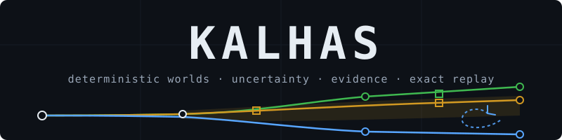
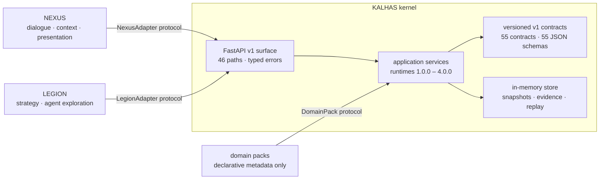

<div align="center">



# KALHAS

A domain-neutral Python kernel for **versioned world models, declared
uncertainty, deterministic simulation campaigns, evidence, and exact replay** —
the decision-world engine in a strict three-role architecture alongside NEXUS
(dialogue and presentation) and LEGION (strategy and agent exploration).

[](https://github.com/Encomm-Tensor-Intelligence/Encomm_Kalhas/actions/workflows/ci.yml)
[](https://docs.astral.sh/uv/)
[](#testing-and-verification)
[](#phase-28--complete-and-published)
[](#testing-and-verification)
[](#testing-and-verification)
[](#testing-and-verification)
[](#testing-and-verification)
[](#core-guarantees)

</div>

## What is KALHAS?

KALHAS records **versioned world models** with declared uncertainty, compiles
them into immutable simulation targets, and runs **deterministic campaigns**
over strategy × shared-seed matrices. Every run emits content-hashed evidence;
every completed run can be **replayed exactly**; every comparison between
strategies shares identical recorded conditions. Runtime evidence is
**empirical and evidence-based under declared models and recorded assumptions
— not calibrated and not certainty.** It performs no autonomous live action.

The kernel is deliberately domain-neutral: domain concerns arrive only as
declarative domain packs consumed through the `DomainPack` protocol, and the
kernel never imports NEXUS or LEGION internals.

## Core guarantees

- **Versioned public contracts.** All 55 public v1 contracts are frozen once
  shipped, with synchronized JSON Schema artifacts; breaking changes require a
  new version module and API segment, never in-place mutation.
- **Deterministic replay.** Completed runs replay exactly, verified against
  recorded input hashes and event hashes — preflight verification before
  execution, integrity verification before any derivation.
- **Fair strategy comparison.** Campaigns execute ordered strategy × seed
  matrices under identical recorded worlds, seeds, and noise coordinates.
- **Immutable evidence.** Executions, observations, decisions, and switch
  events are immutable, content-hashed, and independently re-derivable;
  read-only query services expose verified projections.
- **Fail-closed integrity.** Tampered inputs, forged evidence, and identity
  mismatches are rejected, never repaired or coerced.
- **No live actions.** Local development only — no network calls, no provider
  calls, no real-world effects from the running application.

## Capabilities at a glance

| Area | What it provides |
| --- | --- |
| Contracts & lifecycle | 55 versioned v1 contracts, canonical serialization, content hashes, campaign lifecycle state machine |
| World models | Immutable world versions, domain-pack bindings, capability-input declarations, uncertainty declarations, deterministic realizations |
| Campaign runtime | Structural, realization-aware (`3.0.0`), and adaptive (`4.0.0`) deterministic runtimes with exact replay |
| Evidence | Run/campaign metric observations, empirical outcome distributions (Type-7 quantiles, fixed-alpha tails), objective evaluations |
| Decision support | Immutable decision policies, paired same-seed comparisons, regret/robustness/Pareto evidence, deterministic briefs — read-only, no winners claimed |
| Adaptive runtime 4.0.0 | Causal mid-run observations, closed bounded policy ASTs, dwell/cooldown/budget switching, exact adaptive replay |
| API | FastAPI v1 surface (46 paths / 57 operations), typed error envelope, OpenAPI docs |
| Observability | Operational activity feed; optional local synthetic Colony UI |

## Architecture

| Role | Owns |
| --- | --- |
| **NEXUS** | Natural-language dialogue, organizational context, memory, presentation |
| **LEGION** | Strategy and agent exploration |
| **KALHAS** | Versioned world models, uncertainty, deterministic simulation campaigns, evidence, replay |

These three roles are the only components (see [`AGENTS.md`](AGENTS.md)).
KALHAS couples to the other two solely through the placeholder adapter
protocols in `kalhas/adapters/`.



## Quick start

Requires [uv](https://docs.astral.sh/uv/) (which provisions Python 3.12 and
the virtual environment itself).

```bash
git clone https://github.com/Encomm-Tensor-Intelligence/Encomm_Kalhas.git
cd Encomm_Kalhas
uv sync --python 3.12
uv run uvicorn kalhas.api.app:create_app --factory --host 127.0.0.1 --port 8000
```

Then open <http://127.0.0.1:8000/docs> for the interactive OpenAPI surface.

> If a globally set `PYTHONPATH` shadows the project venv (`ModuleNotFoundError`
> on `uv run`), clear it first: `unset PYTHONPATH` (bash) or
> `Remove-Item Env:PYTHONPATH` (PowerShell).

## Minimal local example

With the server running:

```bash
curl -s http://127.0.0.1:8000/health
curl -s -H "X-Tenant-ID: tenant-1" http://127.0.0.1:8000/v1/system-info
```

Every API response uses one typed error shape (`code`, `message`, `details`,
`request_id`), and every endpoint is tenant-scoped and read-only or
explicitly lifecycle-gated. Full worked scenarios — scenario → world
compilation → campaign preparation → execution → replay → evidence — are in
[`docs/PHASE_HISTORY.md`](docs/PHASE_HISTORY.md).

## Testing and verification

```bash
uv run pytest                              # full suite: 6,850 tests
uv run ruff check .                        # lint
uv run ruff format --check .               # formatting check
uv run mypy kalhas tests                   # strict type check
PYTHONPATH= uv run python scripts/export_schemas.py --check   # schema sync
```

Latest full-suite result: **6,850 tests, 0 failures, 0 errors, 0 skipped**
(Codex-owned Phase 28 audit run, 2026-09-02). `make check` runs the same
gates where GNU make is available.

## Release status

Truthful publication state of `main`. Historical phase-by-phase records,
live API walkthroughs, and per-phase scope statements are preserved in
[`docs/PHASE_HISTORY.md`](docs/PHASE_HISTORY.md).

## Phase 26 — published

Empirical campaign outcome distributions: implementation-complete and
gate-verified, committed, and published at
`886f398c288971d612fa57bd1d1e731113a69f72`.

## Phase 27 — published

Evidence-based campaign decision support: implementation-complete and
gate-verified, committed, and published at
`a905d2af6b155a0f2568037e2b0f410b20be8d91`, followed by the Gate 27.1
truthful-baseline closure published at
`777a4472ef0d1edc6d30ce61a05851302b981027` (5,480 tests, 0 failed,
0 skipped, Codex-owned run).

## Phase 28 — complete and published

Adaptive deterministic runtime `4.0.0`: implementation-complete and
gate-verified across slices `H28-S01`–`H28-S13`, committed, and published at
`f001d5f027cf21e8964eac72f122730e98ebdd3d`. Adds five v1 contracts
(indexes 50–54), five synchronized schema artifacts, three read-only adaptive
API paths, causal observation/decision/switch evidence, and the unpatched
exact-five-plus-adaptive acceptance proof (24 focused tests). The independent
Codex audit accepted checkpoint `CP28-B` on 2026-09-02 with the full suite at
6,850 tests, 0 failures, 0 errors, 0 skipped.

### Phase 29 — not started

KALHAS-PAN is not implemented. Phase 29 requires new explicit authorization;
no Phase 29 design, entry audit, or implementation has begun.

Historical phase-by-phase records, live API walkthroughs, and per-phase scope
statements are preserved in [`docs/PHASE_HISTORY.md`](docs/PHASE_HISTORY.md).

## Documentation

| Document | Contents |
| --- | --- |
| [`AGENTS.md`](AGENTS.md) | Durable repository rules and gates |
| [`docs/PHASE_HISTORY.md`](docs/PHASE_HISTORY.md) | Full phase-by-phase history (Phases 0–28) with worked API examples |
| [`docs/architecture/README.md`](docs/architecture/README.md) | Layer map and dependency rules |
| [`docs/architecture/contracts-and-lifecycle.md`](docs/architecture/contracts-and-lifecycle.md) | Contract versions, lifecycle, and hash discipline |
| [`docs/decisions/`](docs/decisions/) | ADR 001–004 (integration boundaries, domain packs, immutable world contracts, adaptive runtime) |
| [`CHANGELOG.md`](CHANGELOG.md) | Release and checkpoint timeline |
| [`CONTRIBUTING.md`](CONTRIBUTING.md) | Workflow, gates, and acceptance rules |
| [`SECURITY.md`](SECURITY.md) | Scope, reporting, and supported boundaries |

## Known limitations and non-goals

- **Local, in-memory kernel.** No database, no persistence beyond the process,
  no clustering, and no multi-tenancy beyond tenant-scoped identifiers.
- **No live actions.** The running application performs no autonomous live
  action: no network calls, no provider calls, no real-world effects.
- **Determinism is not validity.** Deterministic replay and repository
  acceptance are not scientific validity, not calibration, not certainty, not
  certification, and not a guarantee of any outcome; replay does not establish
  real-world causality; no output is a real-world recommendation. The
  exact-five campaigns are deterministic proofs over synthetic,
  domain-neutral fixture worlds.
- **Colony UI is synthetic.** The bundled observability UI renders mock
  activity and is intentionally separate from the verified evidence pipeline.
- **Domain packs are declarative only.** Manifests, bindings, and declarations
  are inert metadata; no pack is loaded or executed.
- **KALHAS-PAN is not implemented.** Phase 29 (Model Pack foundation) has not
  started and is not authorized.
- **No license yet.** No license has been selected; that is a separate
  explicit decision. All rights are reserved by the repository owner until a
  license is added.

## Contributing and security

Contributions follow the repository's gate discipline — see
[`CONTRIBUTING.md`](CONTRIBUTING.md). Every behavioral change ships with
tests, and `pytest`, `ruff`, and `mypy` must pass before any change is
considered. Security expectations, supported scope, and responsible-disclosure
guidance are in [`SECURITY.md`](SECURITY.md). Pull requests and issues use the
templates under [`.github/`](.github/).
